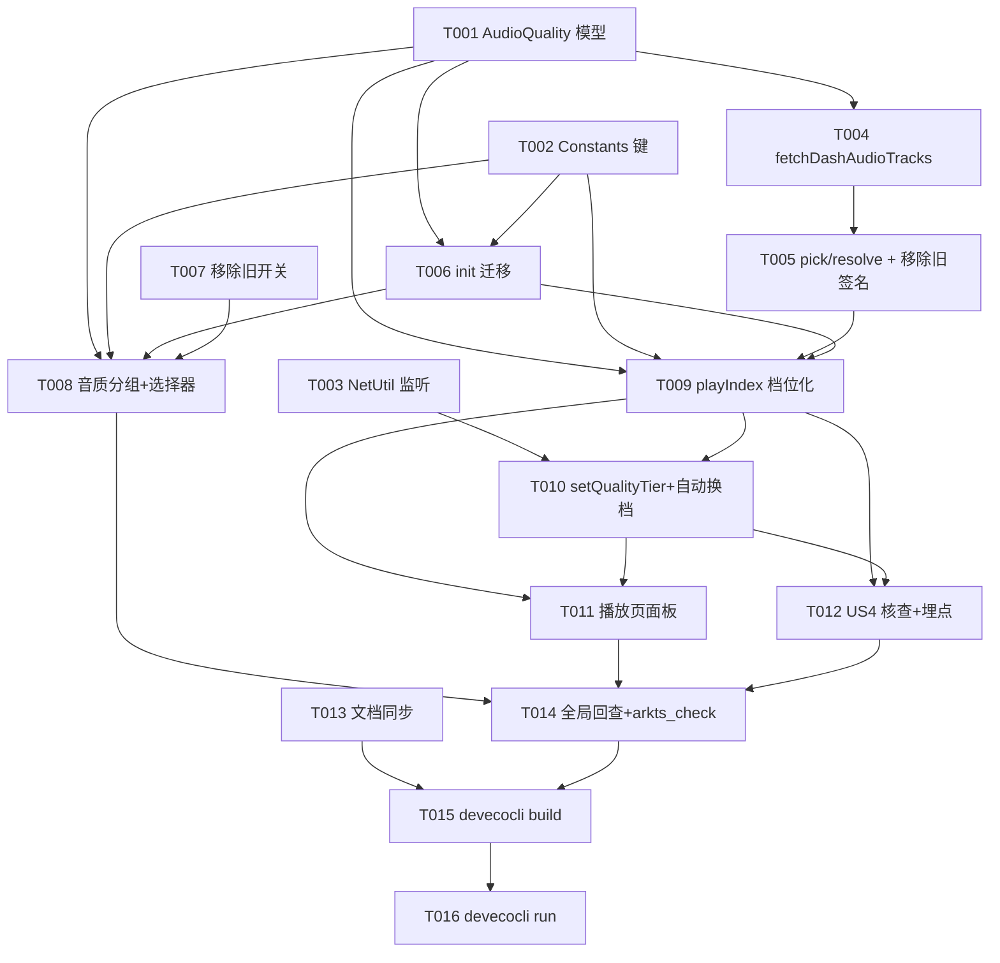

# Tasks: 音质选择与默认音质设置

**Input**: Design documents from `spec/audio-quality-settings/`
**Prerequisites**: plan.md (required), spec.md (required for user stories)

**Tests**: 未要求自动化测试任务，本批验证以编译 + 部署为准（Phase 8，build-only）。

**Organization**: 任务按用户故事分组（US1→US2→US3→US4 顺序），同文件任务严格按 ID 顺序执行避免编辑冲突。

## Format: `[ID] [P?] [Story] Description`

- **[P]**: 可并行（不同文件、无未完成依赖）
- **[Story]**: 所属用户故事

## Path Conventions

- 源码根：`entry/src/main/ets/`（单 HAP entry 模块，遵循现有架构）
- 新增文件仅 1 个：`entry/src/main/ets/model/AudioQuality.ets`

---

## Phase 1: Setup (Shared Infrastructure)

**Purpose**: 三份独立基础件（模型 / 常量 / 网络监听），互不依赖可并行

- [x] T001 [P] 新建 `entry/src/main/ets/model/AudioQuality.ets`：`QualityTier` 枚举（MAX=0、Q192K=30280、Q132K=30232、Q64K=30216）+ `AudioTrack` 类（id: number、bandwidth: number、urls: string[]）+ 静态工具：`fromStored(n)`（非法值回落 MAX）、`label(tier)`（'最高'|'192K'|'132K'|'64K'）、`tierOfTrackId(id)`（30216→Q64K、30232→Q132K、30280→Q192K、30250/30251/未知→MAX）、`trackLabel(id)`（30251→'Hi-Res'、30250→'杜比'、30280→'192K'、30232→'132K'、30216→'64K'）；纯静态方法不使用 this，显式导出
- [x] T002 [P] `entry/src/main/ets/service/Constants.ets`：新增 `KEY_WIFI_AUDIO_QUALITY: string = 'wifiAudioQuality'` 与 `KEY_CELLULAR_AUDIO_QUALITY: string = 'cellularAudioQuality'`；`KEY_PREFER_LOW_BITRATE` 常量保留并加注释「仅供存量迁移读取，链路已退役（audio-quality-settings）」
- [x] T003 [P] `entry/src/main/ets/service/NetUtil.ets`：新增 `watchStableNetworkType(cb: (isWifi: boolean) => void): void`——`connection.createNetConnection().register()` 订阅 netAvailable/netCapabilitiesChange/netUnavailable，默认网络承载类型（Wi-Fi/非 Wi-Fi 二值）相对上次上报值变化后启动 3 秒防抖定时器（窗口内回变则取消），到期以最新类型回调一次；注册/事件异常静默 hilog 警告不影响既有 `isWifi`；首次上报基准在注册后异步初始化；进程生命周期内单例注册不注销

**Checkpoint**: 模型、键、网络监听三件基础件就绪

---

## Phase 2: Foundational (BiliService 取流重构)

**Purpose**: 音轨全量解析 + 回落选择 + 兜底链，阻塞全部用户故事

- [x] T004 `entry/src/main/ets/service/BiliService.ets`：新增 `fetchDashAudioTracks(bvid: string, cid: number): Promise<AudioTrack[]>`——playurl 请求参数 `fnval=16` 改为 `fnval=4048`（qn=16、fnver=0、fourk=0 不变）；解析 `dash.audio[]` 全量音轨（id/bandwidth/baseUrl+backupUrl，沿袭 mcdn 过滤）+ `dash.flac.audio` 单对象（赋 id=30251）+ `dash.dolby.audio` 数组（赋 id=30250）合并进统一列表；按 bandwidth 降序、同 id 保留高带宽去重；响应无 dash 或音轨为空抛错
- [x] T005 `entry/src/main/ets/service/BiliService.ets`：新增 `pickAudioTrack(tracks: AudioTrack[], tier: QualityTier): AudioTrack` 纯函数回落算法（期望档 qn 存在→取之；不存在→取不高于期望 qn 的最高可用档；无任何 ≤期望 档→取可用最高档兜底；MAX→取列表首位即最高带宽含 Hi-Res/杜比；空列表抛错）+ `resolveAudioTrack(bvid: string, cid: number, tier: QualityTier): Promise<AudioTrack>`（fetchDashAudioTracks 失败→原参数重试一次→仍失败 fetchDurlCandidates 包装为 id=0、bandwidth=0 轨道返回）；**移除** `fetchDashAudioCandidates`、`resolveAudioUrl`、`resolveAudioUrlFromCid` 旧布尔参数签名（先全局检索确认除 PlayerController 外无其他调用方，PlayerController 侧由 T009 接管，本任务后编译暂断属预期）

**Checkpoint**: 取流层档位化完成（编译完整性在 T009 后恢复）

---

## Phase 3: User Story 1 - 设置页双默认音质 (Priority: P1) 🎯 MVP

**Goal**: 设置页「音质」分组两项默认档位 + 旧开关退役 + 存量迁移 + 未登录隐藏不支持档位

**Independent Test**: 设置页可见并修改两档默认音质、重启保留；「优先低码率音频流」开关消失；未登录时选择器仅显示「最高」「64K」

### Implementation for User Story 1

- [x] T006 [US1] `entry/src/main/ets/service/PlayerController.ets`：init() 新增存量迁移——读 `KEY_WIFI_AUDIO_QUALITY`，值 <0（getNumber 默认 -1）→ putNumber 写入 MAX(0)；蜂窝档同查，<0→旧 `KEY_PREFER_LOW_BITRATE`==1 ? Q64K(30216) : Q132K(30232)；新增私有辅助「按网络类型读默认档」（NetUtil.isWifi()→KEY_WIFI_AUDIO_QUALITY，否则 KEY_CELLULAR_AUDIO_QUALITY，fromStored 归一），供 playIndex 与自动换档复用
- [x] T007 [US1] `entry/src/main/ets/pages/SettingsPage.ets`：移除「优先低码率音频流」开关行、`preferLowBitrate` @State 声明、aboutToAppear 读取与 onChange 写入（KEY_PREFER_LOW_BITRATE 读写代码全部清除，省流量模式与仅 Wi-Fi 播放两行原样保留）
- [x] T008 [US1] `entry/src/main/ets/pages/SettingsPage.ets`：「播放设置」与「省流量设置」之间新增「音质」分组——「Wi-Fi 默认音质」「蜂窝默认音质」两行（副标题显示 QualityTier.label(当前值)，进入页面时从 AppStore 读取）；点击打开 bindSheet 档位选择面板（沿用既有 bindSheet 面板样式，单 sheet + `qualityEditTarget: 'wifi'|'cellular'` 标记，四档选项 + 当前档高亮，选中 putNumber 持久化并刷新副标题）；`BiliSession.getInstance().isLogged()===false` 时分组尾部提示行「未登录时最高 64K，登录后可用更高音质」且选择器仅渲染「最高」「64K」两项（132K/192K 不显示，已存值不改动）

**Checkpoint**: US1 完成——双默认设置可改可持久化，旧开关退役，未登录档位隐藏

---

## Phase 4: User Story 2 - 按网络套用与稳定切网立即换流 (Priority: P1) 🎯 MVP

**Goal**: 播放按当前网络自动取默认档；网络稳定切换后当前曲目立即换流保进度

**Independent Test**: 蜂窝/Wi-Fi 下播放在线流取对应默认档（面板指示验证）；播放中切换网络类型稳定后换流继续播放不中断

### Implementation for User Story 2

- [x] T009 [US2] `entry/src/main/ets/service/PlayerController.ets`：playIndex 重构——移除 `preferLow` 读取（L515 附近），改为「按网络类型读默认档」；本地缓存路径分支置 `currentTrackSource='local'` 并清空 availableTracks/currentQualityCode=0；在线分支 `resolveAudioTrack(item.bvid, video.cid, tier)` 后记录 `currentCid=video.cid`、`availableTracks=result.tracks`（durl 轨道时为空数组）、`currentQualityCode=result.id`、`currentTrackSource`（'dash'/'durl'），`openStreamWithRetry(result.urls)`；新增公开状态字段 availableTracks/currentQualityCode/currentTrackSource 并随 emitUi 广播（syncFrom 可读）
- [x] T010 [US2] `entry/src/main/ets/service/PlayerController.ets`：新增 `setQualityTier(tier: QualityTier, writeBack: boolean): Promise<void>`——守卫（currentTrackSource==='dash' 且非 isPreparing，否则静默跳过 + Logger 'player'）；捕获 currentTime 与播放态（isPlaying && !pausedByUser）；取消挂起 seekBy 防抖；置 isPreparing + statusMsg「正在切换音质…」+ emitUi；loadToken++ 后以 currentCid 调 resolveAudioTrack 解析新档 → openStreamWithRetry → prepared 回调既有机制 seek(进度) 并按原播放态恢复；失败回滚（isPreparing=false、statusMsg 还原、Logger 记录，保持原流已断则 best-effort 以原 currentQualityCode 重解析恢复）；成功后更新三状态字段 + emitUi + statusMsg「已切换 132K」样式提示；writeBack=true 时按 NetUtil.isWifi() putNumber 对应键，writeBack=false 不写；init() 末尾注册 `NetUtil.watchStableNetworkType` 回调→私有 `applyDefaultTierForNetwork()`（source==='dash' 且非 isPreparing 时按新网络默认档 setQualityTier(tier, false)，失败保持原流仅 Logger）

**Checkpoint**: US2 完成——按网络取档 + 稳定切网立即换流（编译自 T005 断开后在此恢复完整）

---

## Phase 5: User Story 3 - 播放页音质面板与即时切换 (Priority: P2)

**Goal**: 播放页面板列出实际可用音轨、当前档高亮、点选换流并写回对应网络默认值

**Independent Test**: 播放中打开音质面板见可用档位与当前档；切换后进度保持继续播放；设置页对应网络默认值同步更新

### Implementation for User Story 3

- [x] T011 [US3] `entry/src/main/ets/pages/PlayerOverlay.ets`：控制按钮行（倍速/模式/睡眠/队列所在行）新增音质入口图标按钮（样式同既有入口，SymbolGlyph 波形/音符类系统图标）+ `showQuality` @State；新增 `qualityPanel()` 面板（根 Stack `if (this.showQuality)` 挂载，层级/样式对齐 speedPanel/modePanel）——dash 源：列出 `controller.availableTracks`（trackLabel 显示，当前 currentQualityCode 高亮），点选调 `setQualityTier(tierOfTrackId(id), true)` 并关闭面板；local 源：显示「本地缓存」占位无选项；durl 源：显示「默认（当前不可用）」占位无选项；未登录时面板天然仅显示实际下发音轨（不支持的不显示），不额外加提示；syncFrom 增量同步 availableTracks/currentQualityCode/currentTrackSource/showQuality 需要的 @State 镜像；根容器下滑退出手势 `noOverlayOpen` 条件加入 `!this.showQuality`

**Checkpoint**: US3 完成——面板切换、写回、来源占位全部就位

---

## Phase 6: User Story 4 - 档位回落、登录态限制与降级保护 (Priority: P2)

**Goal**: 回落矩阵 / 失败重试 / 登录态过期降级全覆盖且可诊断

**Independent Test**: 未登录播放在线流正常出声且实际取 64K；切歌遇不支持档位自动回落不中断

### Implementation for User Story 4

- [x] T012 [US4] 核查 + 埋点：对照 spec US4 验收场景 1-6 逐条核查实现覆盖——未登录高档回落（T005 回落算法 + playurl 实际下发）、失败 64K 重试（T005 resolveAudioTrack 重试）、自动档 Hi-Res/杜比升级（T004 节点解析 + T005 MAX 分支）、切歌回落（T009 每曲重解析）、登录态过期降级（每曲按实际下发，无本地缓存拦截）；在 `entry/src/main/ets/service/BiliService.ets` resolveAudioTrack/pickAudioTrack 与 `entry/src/main/ets/service/PlayerController.ets` setQualityTier/playIndex 补 Logger 'player' 诊断埋点（期望档、实际档 qn、回落原因、换流成功/失败），不足处补齐

**Checkpoint**: US4 完成——全场景回落可验证、链路可追溯

---

## Phase 7: Polish & Cross-Cutting Concerns

**Purpose**: 文档同步与全局回查

- [x] T013 [P] 文档同步：`PROJECT_NOTES.md` 第三章音质条目更新为完成状态（保留档位/默认/限制要点）；`spec/ui-testing-playbook.md` 设置页区块顺序描述更新为「账号 → 本地与缓存 → 播放设置 → 音质（新增）→ 省流量 → 外观 → 播放历史 → 日志查询 → 取消收藏历史 → 关于」并注明省流量分组仅剩省流量模式与仅 Wi-Fi 播放两项
- [x] T014 全局回查：确认无 `preferLowBitrate`/`preferLow`/`fetchDashAudioCandidates`/`resolveAudioUrlFromCid`/`resolveAudioUrl(` 残留引用（`KEY_PREFER_LOW_BITRATE` 仅剩 Constants 定义与 T006 迁移读取两处）；确认 fnval=4048 请求参数无遗漏分支、durl 兜底与本地缓存路径 source 标记完整；对全量改动 .ets 文件（AudioQuality.ets、Constants.ets、NetUtil.ets、BiliService.ets、PlayerController.ets、SettingsPage.ets、PlayerOverlay.ets）跑 `arkts_check` 严格模式静态检查零诊断

---

## Phase 8: Verification

<!-- verification_scope: build-only -->

**Purpose**: 构建与部署验证（用户已选择 build-only，不含 UI 验证任务）

- [x] T015 构建项目并修复编译错误直至成功（调用 `devecocli build`，迭代 修复→构建）
- [x] T016 部署应用到设备/模拟器（调用 `devecocli run --skip-build`）

---

## Dependencies & Execution Order

### Phase Dependencies

- **Setup (Phase 1)**: T001/T002/T003 互不依赖可并行；阻塞后续全部任务
- **Foundational (Phase 2)**: T004→T005 同文件顺序；阻塞全部用户故事
- **US1 (Phase 3)**: T006 依赖 T001/T002；T007→T008 同文件顺序（依赖 T001/T002）
- **US2 (Phase 4)**: T009 依赖 T005（新签名）+ T003/T006；T010 依赖 T009（同文件顺序 + 复用状态字段）
- **US3 (Phase 5)**: T011 依赖 T009/T010（读状态 + 调 setQualityTier）
- **US4 (Phase 6)**: T012 依赖 T004/T005/T009/T010（全链路核查）
- **Polish (Phase 7)**: T013 可与 T011/T012 并行；T014 依赖全部实现任务
- **Verification (Phase 8)**: 依赖 Phase 7 完成

### Within Each User Story

- 服务层（BiliService/PlayerController）先于 UI 层（SettingsPage/PlayerOverlay）
- 同文件任务严格按 ID 顺序执行，避免编辑冲突
- T005→T009 之间存在预期编译断档（旧签名已删、调用方未接），T009 完成后恢复

## 📊 Dependency Graph



## ⚡ Parallel Execution Guide

| Phase | Tasks | Required Files | Execution Notes |
|-------|-------|----------------|-----------------|
| Setup | T001 ∥ T002 ∥ T003 | AudioQuality.ets ∥ Constants.ets ∥ NetUtil.ets | 三文件互不依赖，可同时开始 |
| US1 | T006 ∥ T007 | PlayerController.ets ∥ SettingsPage.ets | 不同文件可并行；T008 须在两者之后 |
| Polish | T013 ∥ T011/T012 | 文档 ∥ ets 源码 | 文档同步不依赖代码完成后的最终状态可在 T012 后校对 |

## Parallel Example: Setup Phase

```bash
# 并行启动不同文件的基础件：
Task: "T001 AudioQuality 模型"   # entry/src/main/ets/model/AudioQuality.ets（新建）
Task: "T002 Constants 音质键"    # entry/src/main/ets/service/Constants.ets
Task: "T003 NetUtil 网络监听"    # entry/src/main/ets/service/NetUtil.ets

# US1 阶段跨文件并行：
T006（PlayerController.ets 迁移） ∥ T007（SettingsPage.ets 移除旧开关）
# 随后同文件顺序：
T007 → T008（SettingsPage.ets 新增音质分组）
```

## Implementation Strategy

### MVP First (P1 Stories Only)

1. 完成 Phase 1: Setup（T001–T003）
2. 完成 Phase 2: Foundational（T004–T005）
3. 完成 Phase 3: US1 设置页双默认（T006–T008）
4. 完成 Phase 4: US2 按网络套用与切网换流（T009–T010）
5. **STOP and VALIDATE**: 编译验证 P1 两故事（此时可提前跑一次 `devecocli build` 确认无回归）

### Incremental Delivery

1. Setup → Foundational → 取流层档位化就绪
2. US1 → US2（P1，双默认 + 自动套用，发布价值核心）
3. US3 → US4（P2，面板切换 + 回落保护）
4. Polish → Verification
5. 每个故事 Checkpoint 均可独立验证，不破坏已完成故事

### Sequential Execution (Single Agent)

单人/单代理按 T001→T016 顺序执行即可；[P] 标记仅提示"如有多代理可并行"，顺序执行无冲突。

## Notes

- [P] 任务 = 不同文件、无未完成依赖
- [Story] 标签映射 spec.md 用户故事，保证可追溯
- 同一文件被多个故事触碰（PlayerController: US1+US2+US4；SettingsPage: US1；PlayerOverlay: US3；BiliService: Foundational+US4），任务已按 ID 顺序排列，严格顺序执行避免编辑冲突
- T005 删除旧签名后至 T009 接管前存在预期编译断档，勿在中间跑构建
- Verification 为 build-only（用户已选择），不含 UI 验证任务
- 「省流量模式」（KEY_DATA_SAVER 封面/头像）与「仅 Wi-Fi 播放」（KEY_WIFI_ONLY_DOWNLOAD）链路一行不动（FR-011）

## Summary Report

- **总任务数**: 16（T001–T016）
- **按阶段分布**: Setup 3；Foundational 2；US1 3；US2 2；US3 1；US4 1；Polish 2；Verification 2
- **并行机会**: 3 组（Setup 三件套；US1 的 T006∥T007；Polish T013 与实现尾段）
- **独立测试标准**: 各故事 Checkpoint 已给出独立验证方式
- **建议 MVP 范围**: T001→T010（P1 两故事：US1 双默认设置、US2 按网络套用+切网换流）
