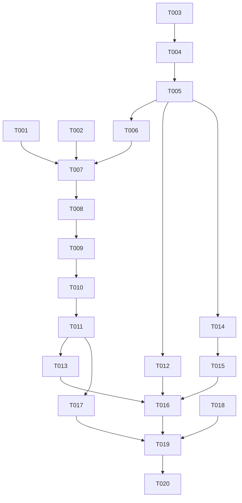

# Tasks: B站链接识别与短链解析修复（KI-4 闭环）

**Input**: Design documents from `spec/bili-link-recognize/`（spec.md + plan.md）
**Prerequisites**: plan.md（架构决策 D1-D9）、spec.md（US1-US5）均已评审确认
**Tests**: 无自动化测试框架，不生成测试任务；采用静态走查 + 构建 + 实机验证
**Organization**: 按用户故事分组，每个故事可独立交付验证

## Format: `[ID] [P?] [Story] Description`

- **[P]**: 可并行（不同文件、无未完成依赖）
- **[Story]**: 所属用户故事（US1-US5，映射 spec.md）

## Path Conventions

既有 HarmonyOS 工程，全部路径相对 `entry/src/main/ets/`；备忘录在仓库根目录。

---

## Phase 1: Setup (Shared Infrastructure)

无需任务——既有工程增量改造，无新依赖、无脚手架、无配置变更。

---

## Phase 2: Foundational (Blocking Prerequisites)

**Purpose**: 识别链路的公共基座（常量、可复用请求头、LinkResolver 骨架与迁移）

- [x] T001 [P] 在 `service/Constants.ets` 新增短链解析专用超时常量 `SHORT_LINK_CONNECT_MS = 8000`、`SHORT_LINK_READ_MS = 8000`（只增不改，紧邻现有 CONNECT_TIMEOUT_MS/READ_TIMEOUT_MS）
- [x] T002 [P] 在 `service/BiliService.ets` 为现有模块级常量 `USER_AGENT`、`REFERER` 补 `export` 导出（供 LinkResolver 复用，保持请求头一致；本任务不删任何方法）
- [x] T003 创建 `service/LinkResolver.ets` 文件骨架：文件头注释（用途：KI-4 链接抽取/识别/短链解析集中地）、导入（`@kit.NetworkKit` http、Logger、Constants、BiliService 导出的 UA/REFERER），并定义三个数据模型——`RecognizeResult`（type/id/ownerMid，自 AddSubscriptionSheet.ets 迁入语义）、`ShortLinkOutcome` 结局常量集（'ok'|'network'|'hops'|'no-target'|'unrecognized'）、`ShortLinkResult`（outcome/target/message）
- [x] T004 在 `service/LinkResolver.ets` 实现导出函数 `extractBiliUrl(raw: string): string`：抽取文本中第一个 B 站域名（b23.tv / bili2233.cn / bilibili.com 及任意子域，忽略大小写）的 http(s) 链接，清除尾随中英文标点（句号/叹号/问号/右括号/引号等）；未抽到时返回 `raw.trim()`（plan.md FR-001/D9）
- [x] T005 在 `service/LinkResolver.ets` 将 `pages/AddSubscriptionSheet.ets` 的 `recognizeInput`（现 L21-86）与 `RecognizeResult`（现 L15-19）原样迁入并导出：**八条规则语义、顺序、大小写行为全部保持不变**（本任务零扩展，扩展在后续故事；迁移后 AddSubscriptionSheet 暂以 import 引用，本地定义删除）

**Checkpoint**: LinkResolver 具备抽取与既有识别能力，页面可编译引用。

---

## Phase 3: User Story 1 - 分享文案直达视频 (Priority: P1) 🎯 MVP

**Goal**: 含 b23.tv 短链的分享文案粘贴即达视频目标（含 BV 路径短路、Location 解析、缓存、分型失败）
**Independent Test**: 粘贴真实视频分享文案「【…】 https://b23.tv/BV1iMtG6YEyr」→ 跳过网络直接播放；粘贴路径不含视频号的视频短链 → 经 302 Location 解析后播放

- [x] T006 [US1] 在 `service/LinkResolver.ets` 实现导出函数 `isBiliShortLink(url: string): boolean`（host 为 b23.tv / bili2233.cn，忽略大小写）与裸域名归一化（输入形如 `b23.tv/xxx` 无协议前缀时补 `https://`；归一化可在函数内或独立导出小函数）
- [x] T007 [US1] 在 `service/LinkResolver.ets` 实现导出异步函数 `resolveShortLink(shortUrl: string): Promise<ShortLinkResult>` 主链路（plan.md D1/D4/D8）：先查缓存；请求设 `maxRedirects: 0`、专用超时（T001 常量）、UA/REFERER 头（T002 导出）；3xx 时大小写不敏感读响应头 `location`，相对地址按当前短链协议+域名补全；Location 仍为短链域名则迭代跟进（上限 3 跳，超出返回 outcome='hops'）；最终目标须为 B 站域名（否则 'no-target'）；网络异常捕获返回 'network'；全部失败路径携带对应中文用户提示文案
- [x] T008 [US1] 在 `service/LinkResolver.ets` 的 `resolveShortLink` 前置视频号短路（plan.md D7）：短链 path 部分含 `BV` + 10 位字母数字时直接返回 outcome='ok' + 视频页目标地址，不发任何网络请求、不写缓存
- [x] T009 [US1] 在 `service/LinkResolver.ets` 实现模块级静态会话缓存（plan.md D3）：`Map<string, ShortLinkResult>`，键为 host 小写化的规范化短链；容量 50（命中先删后插实现 LRU 新鲜度，超容量淘汰最旧键）；仅缓存 outcome='ok' 结果；命中路径零网络
- [x] T010 [US1] 在 `service/LinkResolver.ets` 实现正文兜底（plan.md D6，FR-009）：仅当响应非 3xx（无 Location）时启用；**只提取**正文中带 bilibili.com 域名（任意子域）的完整 URL 交识别器分类，**禁止裸扫孤立 BV 号**；无匹配返回 'no-target'
- [x] T011 [US1] 改造 `pages/AddSubscriptionSheet.ets` 的 `handleMainInput`（现 L157-239）为新编排：收起键盘 → `extractBiliUrl` 清洗 → 裸短链归一化 → `isBiliShortLink` 为真时置 busy 并调 `resolveShortLink`，按 `outcome` 分型展示提示（成功则对 `target` 调 `recognizeInput` 走既有六分支分发：bv→playBv / av→playAv / up→lookupUid / fav→subscribeFolderById / season→subscribeSeasonById / series→subscribeSeriesById，全部动作方法不动；失败按 message 提示）→ 非短链分支对清洗后文本直接 `recognizeInput` + 既有分发；**删除 `this.mainInput = resolved` 回写**（FR-010）；**非短链分支改用清洗后文本**（修复未 trim 失配）

**Checkpoint**: US1 全链路可用——两条视频形态输入（路径带/不带视频号）均可独立验证。

---

## Phase 4: User Story 2 - 分享文案直达 UP 订阅视图 (Priority: P1)

**Goal**: UP 空间分享文案（Location 为 `m.bilibili.com/space/{uid}` 移动端形态）正确识别为 UP 目标
**Independent Test**: 粘贴真实空间分享文案「【暮月Medus的个人空间-哔哩哔哩】 https://b23.tv/h2Ers3k」→ 进入该 UP 详情订阅视图；已订阅时仍进详情视图且重复订阅被既有逻辑拦截

- [x] T012 [US2] 在 `service/LinkResolver.ets` 扩展 `recognizeInput`（plan.md D5-2）：新增「host 为 bilibili.com 任意子域（含 m.）的 `/space/{数字}` 路径 → type='up'」规则；规则插入位置须不改变既有桌面形态与更高优先级规则的行为（置于现有 `space.bilibili.com/{数字}` 规则之前或合并实现均可）

**Checkpoint**: US1 + US2 两个真实示例场景全通。

---

## Phase 5: User Story 3 - 解析健壮性与可读失败 (Priority: P2)

**Goal**: 大小写/双域名/裸域名判定无漏，缓存命中零网络，四类失败提示分型清晰
**Independent Test**: 构造 `B23.TV`、`bili2233.cn`、裸域名 `b23.tv/xxx`、同一短链二次提交等输入走查，核对判定、缓存与提示文案

- [x] T013 [US3] 健壮性边界走查与补齐（`service/LinkResolver.ets` + `pages/AddSubscriptionSheet.ets`）：逐项核对①大写域名（B23.TV）②bili2233.cn 域名③裸域名补前缀④缓存命中零网络请求（核对 Logger 日志点存在且位于网络请求之前）⑤专用超时接线（未误用通用常量）⑥四类失败（网络失败/超出跳数/无有效目标/目标无法识别）提示文案齐全且互不重复；发现缺口即在本任务内补齐

**Checkpoint**: FR-001/#1/#4/#6 相关边界全部闭环。

---

## Phase 6: User Story 4 - 目标类型覆盖扩展 (Priority: P2)

**Goal**: av 号 URL 形态与收藏夹/合集/系列（含移动端形态）正确分发
**Independent Test**: 逐类输入目标 URL，确认分别进入播放/对应订阅分支，与桌面形态行为一致

- [x] T014 [US4] 在 `service/LinkResolver.ets` 扩展 `recognizeInput`（plan.md D5-1）：新增「bilibili.com/video/av{数字}（忽略大小写）→ type='av'」规则，置于 BV 全文扫描之后、空间/合集规则之前
- [x] T015 [US4] 在 `service/LinkResolver.ets` 扩展 `recognizeInput`（plan.md D5-3）：将 favlist/fid、lists、collectiondetail、seriesdetail 四类规则的 host 匹配放宽为「bilibili.com 任意子域」，桌面形态行为不变（回归以既有输入为准）

**Checkpoint**: KI-4 #5 目标覆盖补齐。

---

## Phase 7: User Story 5 - 既有输入零回归 (Priority: P3)

**Goal**: 既有七类直接输入与非链接文本行为 100% 不变
**Independent Test**: 回归清单逐项静态比对新旧识别行为

- [x] T016 [US5] 在 `service/LinkResolver.ets`（必要时含 `pages/AddSubscriptionSheet.ets`）执行回归走查：①新旧识别规则逐条比对（BV 全文 / ^av 全串 / lists / seriesdetail / collectiondetail / fid+fav / space / 纯数字）确认既有命中行为不变②七类既有输入形态（BV 号 / 裸 av 号 / 纯数字 UID / 五类完整 URL）逐一核对分发结果③边界确认：尾随标点清除、多链接取第一个、首尾空格输入（`" 123 "` 应识别为 UID）、不含 B 站链接的文本回退现状提示且零网络请求；走查结论记录于任务输出

**Checkpoint**: 全部用户故事完成，可进入清理与验证。

---

## Phase 8: Polish & Cross-Cutting Concerns

**Purpose**: 死代码清理与备忘录闭环登记

- [x] T017 在 `service/BiliService.ets` 删除 `resolveShortUrl`（现 L935-966），全局检索确认无残留引用（原唯一调用方已在 T011 切换）
- [x] T018 [P] 更新仓库根 `PROJECT_NOTES.md`：KI-4 条目改写为修复说明（Location 解析方案、缓存、分型、覆盖扩展；**状态标「已修复（待实机复核 US1/US2）」**；修正登记行号漂移——短链判定原 L144→L165、resolveShortUrl 原 L707-736→L935-966）；并按备忘录格式新登记本轮范围外发现：系列默认类型歧义（B3）、BV 优先级全文遮蔽（B4）、fav 弱启发式（B5）、裸数字语义歧义（B7）、BV 无合法性校验（B8）、解析结果回写已随本轮移除（C1-已解决）、动态/直播/watchlist 目标不识别（C2）

---

## Phase 9: Verification

<!-- verification_scope: build-only -->

**Purpose**: 构建与部署验证（本轮验证范围：build-only，不含 UI 自动化验证；US1/US2 真实分享文案的实机人工验证由用户在部署后自行执行）

- [x] T019 对改动文件运行 `arkts_check` 静态检查后执行 `devecocli build`，修复编译/静态检查错误并迭代直至构建成功
- [x] T020 执行 `devecocli run --skip-build` 将应用部署到已连接设备/模拟器，确认安装启动正常

---

## Dependencies & Execution Order

### Phase Dependencies

- **Foundational（T001-T005）**: T001/T002 可并行；T003 → T004 → T005 同文件顺序执行；T005 完成前不得开始任何故事任务
- **US1（T006-T011）**: T006-T010 同文件（LinkResolver.ets）顺序执行；T011 依赖 T004-T010 全部完成（AddSubscriptionSheet.ets）
- **US2/US4（T012/T014/T015）**: 依赖 T005；与 T011 无文件冲突但建议在 T011 后执行（识别扩展无需页面配合）
- **US3（T013）**: 依赖 T011（提示接线完成才能走查）
- **US5（T016）**: 依赖 T012/T014/T015（扩展完成后做全量回归比对）
- **Polish（T017/T018）**: T017 依赖 T011（调用方已切换）；T018 与 T017 可并行
- **Verification（T019-T020）**: T019 依赖全部前序任务；T020 依赖 T019

### User Story Dependencies

- US1（P1）: Foundational 后即可开始，MVP 核心
- US2（P1）: 依赖 T005（识别器就位），与 US1 的页面改造无阻塞
- US3（P2）: 依赖 US1 的 T011（分型提示接线）
- US4（P2）: 依赖 T005，独立于 US1/US2
- US5（P3）: 依赖全部扩展完成后做回归，天然最后

### 📊 Dependency Graph



### ⚡ Parallel Execution Guide

| Phase | Tasks | Required Files | Execution Notes |
|---|---|---|---|
| Foundational | T001, T002 | Constants.ets / BiliService.ets | 不同文件，可并行 |
| US2 与 US1 后半 | T012 与 T008-T010 | LinkResolver.ets | 同文件，串行更安全；如并行须合并提交 |
| Polish | T017, T018 | BiliService.ets / PROJECT_NOTES.md | 不同文件，可并行 |

---

## Parallel Example: Foundational Phase

```bash
# Launch both independent file-level tasks together:
Task: "T001 新增短链专用超时常量" (Constants.ets)
Task: "T002 导出 USER_AGENT/REFERER" (BiliService.ets)

# Then sequentially on the shared new file (LinkResolver.ets):
Task: "T003 骨架与模型" → "T004 extractBiliUrl" → "T005 recognizeInput 迁移"
```

---

## Implementation Strategy

### MVP First（US1 + US2）

1. Foundational（T001-T005）→ US1（T006-T011）→ US2（T012）
2. **STOP and VALIDATE**: 两条真实分享文案（视频/空间）粘贴即达目标
3. 部署后用户实机复核 US1/US2（build-only 验证范围下的人工环节）

### Incremental Delivery

Foundational → US1（MVP）→ US2（第二真实场景）→ US3/US4（健壮性与覆盖）→ US5（回归锁定）→ Polish → Verification

---

## Notes

- 同一文件（LinkResolver.ets）上的任务一律串行执行，避免编辑冲突
- T005 迁移时严禁顺手扩展——扩展统一在 T012/T014/T015，保证回归基线干净
- T011 是唯一涉及 `pages/AddSubscriptionSheet.ets` 的任务，页面六个分发动作方法（playBv/playAv/lookupUid/subscribeFolderById/subscribeSeasonById/subscribeSeriesById）零改动
- QueueSheet.ets 的 addByBv 本轮零改动（plan.md 范围标记）
