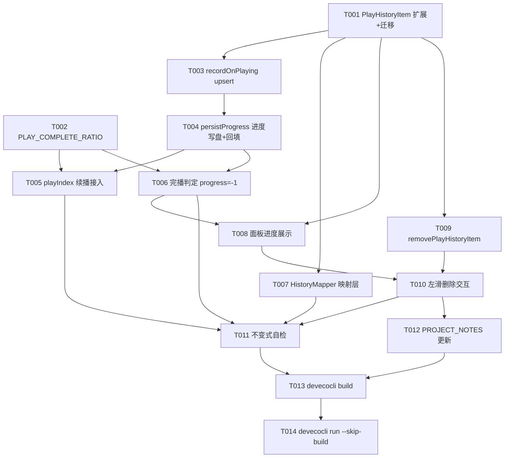

# Tasks: 播放历史与进度记录（B 站历史同步预留）

**Input**: Design documents from `spec/play-history-progress/`（spec.md + plan.md）
**Prerequisites**: plan.md（必需）、spec.md（用户故事来源）
**Tests**: 未要求自动化测试（项目无测试框架，验证走构建+部署，见 Verification 阶段）

**Organization**: 任务按用户故事分组；改动文件路径以 `entry/src/main/ets/` 为根。

## Format: `[ID] [P?] [Story] Description`

- **[P]**: 可并行（不同文件、无未完成依赖）
- **[Story]**: 所属用户故事（US1/US2/US3）

## Path Conventions

- 存量单模块工程：源码根为 `entry/src/main/ets/`（`model/`、`service/`、`pages/`、`component/`）
- 本特性涉及文件：`entry/src/main/ets/model/PlayHistoryItem.ets`、`entry/src/main/ets/service/Constants.ets`、`entry/src/main/ets/service/HistoryMapper.ets`（新建）、`entry/src/main/ets/service/PlayerController.ets`、`entry/src/main/ets/pages/SettingsPage.ets`、`entry/src/main/ets/pages/SourcePage.ets`（回归点，仅复核）、`PROJECT_NOTES.md`（仓库根）
- 设计文档：`spec/play-history-progress/`（spec.md / plan.md / tasks.md）

---

## Phase 1: Setup (Shared Infrastructure)

存量工程增量特性，项目结构与构建配置已就绪——**本阶段无需任务**，直接进入 Foundational。

---

## Phase 2: Foundational (Blocking Prerequisites)

**Purpose**: 所有用户故事共同依赖的模型字段与常量。**⚠️ 本阶段完成前不得开始任何故事任务。**

- [X] T001 [P] 扩展 `PlayHistoryItem`：新增 `viewAt`（秒级时间戳）、`progress`（秒，-1=已看完，默认 0）、`duration`（秒，0=未知）、`cid`（分P标识，0=未知）四字段；`fromVideo` 演进签名（playedAt 毫秒入参改为内部转秒）；`toRecord` 写出新字段、不再写出 `playedAt`；`fromRecord` 迁移规则：`viewAt` 缺失且旧 `playedAt`(ms) 存在 → `floor(playedAt/1000)`，其余缺失字段取默认值（FR-005/FR-006）——`entry/src/main/ets/model/PlayHistoryItem.ets`
- [X] T002 [P] 新增常量 `PLAY_COMPLETE_RATIO = 0.95`（完播阈值，FR-003/FR-004），置于既有进度常量（`PROGRESS_SAVE_INTERVAL_MS`）附近——`entry/src/main/ets/service/Constants.ets`

**Checkpoint**: 模型字段与阈值常量就绪，故事任务可以开始。

---

## Phase 3: User Story 1 - 每集独立进度与智能续播 (Priority: P1) 🎯 MVP

**Goal**: 听过的每集内容都有独立进度；再次播放时未听完续播、已听完（≥95% 或自然播完）从头。

**Independent Test**: 播放 A 超 30 秒 → 切到 B → 从历史/队列切回 A，验证从上次进度续播；将 A 拖至 ≥95% 处切走再重播，验证从 00:00 开始。

### Implementation for User Story 1

- [X] T003 [US1] `recordOnPlaying` 改 upsert 语义（plan R3，本特性最关键修正）：命中同 bvid 旧条目时**保留** progress/duration/cid，仅刷新 viewAt(秒)/title/cover/ownerName/sourceType 后置顶；未命中才新建（progress=0）。仍仅在 `playing` 状态触发——`entry/src/main/ets/service/PlayerController.ets`（依赖 T001）
- [X] T004 [US1] `persistProgress` 扩展（plan R6/R7）：在写全局断点（KEY_LAST_INDEX/KEY_LAST_POS_MS，此路径零改动）的同时，更新当前条目 `progress = floor(currentTime/1000)`，并沿 `PROGRESS_SAVE_INTERVAL_MS`(5s) 节拍异步写历史文件（复用既有 `setTimeout(0)` + `AppStore.savePlayHistoryFile` 模式）；duration 回填（`prepared` 后 `player.duration` ms→秒）与 cid 回填（取 `currentCid` 或 `BiliVideo.cid` 非零者）——`entry/src/main/ets/service/PlayerController.ets`（依赖 T003）
- [X] T005 [US1] `playIndex` 续播接入（plan R4）：进入时若旧曲目索引有效且已在播放则即时 flush 其进度；`seekMs <= 0` 时以新方法 `getResumeMsForBvid(bvid): number` 决定起点（条目存在且 progress>0 且 ≠-1 且（duration>0 时 progress < duration×PLAY_COMPLETE_RATIO）→ progress×1000，否则 0）；`seekMs > 0` 的换音质/断点恢复路径零变化——`entry/src/main/ets/service/PlayerController.ets`（依赖 T002、T004）
- [X] T006 [US1] 完播判定（plan R5）：`onPlayerState('completed')` → 当前条目 `progress = -1` 并即时写盘；`onPlayerTime` 中当 `duration > 0 && currentTime >= duration × PLAY_COMPLETE_RATIO` 时同样置 -1（duration 未知时不做阈值判定）——`entry/src/main/ets/service/PlayerController.ets`（依赖 T002、T004）

**Checkpoint**: US1 独立可测——切歌续播/从头、崩溃回退 ≤5s 均应生效。

---

## Phase 4: User Story 2 - 历史数据模型对齐 B 站（同步预留） (Priority: P2)

**Goal**: 本地条目字段/单位与 B 站历史条目一一对应，映射集中独立；本轮零网络请求。

**Independent Test**: 查看 `play_history.json`，确认新字段（viewAt/progress/duration/cid）存在且单位为秒；旧记录升级后全部保留；`HistoryMapper` 双向映射字段对照正确（人工核对 plan.md Data Model 表）。

### Implementation for User Story 2

- [X] T007 [P] [US2] 新建 `HistoryMapper`（plan R9，FR-011/FR-012）：定义 `BiliHistoryRecord`（bvid/cid/progress/duration/viewAt/title/showTitle/authorName/cover/business，字段对照见 plan.md Data Model）；实现纯静态映射 `toBiliHistory(item)` 与 `fromBiliHistory(rec)`（单位直通、showTitle 置空、business='archive'、逆向 sourceType 置 SOURCE_LOCAL）；文件头注释注明「同步预留边界：本轮无网络调用方，fromBiliHistory 供未来拉取合并使用」——`entry/src/main/ets/service/HistoryMapper.ets`（依赖 T001，与 Phase 3 任务不同文件可并行）

**Checkpoint**: US2 独立可测——模型字段与映射边界就位，存储数据格式对齐 B 站。

---

## Phase 5: User Story 3 - 历史面板增强：进度展示与单条删除 (Priority: P3)

**Goal**: 面板条目可见进度（剩余时长/已听完），点击智能续播，左滑单条删除（补 KI-3 播放历史项）。

**Independent Test**: 打开设置 → 播放历史面板：未听完条目显示「剩 mm:ss」、听完条目显示「已听课标」；左滑任意条目露出「删除」，点击后消失且重启 App 仍不存在；点击未听完条目验证从上次进度续播。

### Implementation for User Story 3

- [X] T008 [US3] 面板进度展示（plan R10，FR-008/FR-010）：条目第二行按 `progress === -1` → 「已听完」标识、`progress > 0 && duration > 0` → 「剩 mm:ss」（duration-progress 格式化）、其余降级为日期文本；`formatPlayedAt` 适配 `viewAt` 秒入参（`new Date(viewAt*1000)`）；`LazyForEach` key 由 `bvid_playedAt` 改为 `bvid_viewAt_progress`——`entry/src/main/ets/pages/SettingsPage.ets`（依赖 T001、T006；本任务同时消除 T001 移除 `playedAt` 引发的编译断点）
- [X] T009 [US3] 单条删除 API（FR-009）：`removePlayHistoryItem(bvid: string): void`——命中则 splice、`playHistoryVersion++`、异步写盘，未命中静默；保持 `clearPlayHistory` 行为不变（FR-014）——`entry/src/main/ets/service/PlayerController.ets`（依赖 T001）
- [X] T010 [US3] 面板左滑删除交互（FR-009，KI-3 交互约定）：`ListItem.swipeAction({ end: 删除按钮 builder })`，红色「删除」按钮点击调 `removePlayHistoryItem`，并通过 `HistoryDataSource` 的 `notifyDataDelete`（若无该通知方法则补齐）同步 LazyForEach；不做滑过阈值直删——`entry/src/main/ets/pages/SettingsPage.ets`（依赖 T008、T009）

**Checkpoint**: US3 独立可测——三个故事全部就位，功能完整。

---

## Phase 6: Polish & Cross-Cutting Concerns

**Purpose**: 跨故事的一致性自检与文档登记。

- [X] T011 不变式自检（plan「不变式」清单）：① 全局断点 KEY_LAST_INDEX/KEY_LAST_POS_MS 读写路径零改动复核；② 全局检索确认本特性代码路径无任何 B 站网络请求调用（FR-012）；③ 关键路径（upsert/续播决策/完播标记/单条删除）hilog 日志覆盖；④ `SourcePage.loadPlayedSet` 读取历史文件的回归确认（仅用 bvid，迁移后行为不变）——涉及 `entry/src/main/ets/service/PlayerController.ets`、`entry/src/main/ets/pages/SourcePage.ets`（依赖 T005-T010）
- [X] T012 [P] 更新项目备忘：KI-3「播放历史单条删除」条目标注已完成（首页订阅列表/播放队列两项保持未实现登记不变）；第三章「播放历史云端同步」条目更新为「本地字段/单位对齐已完成（HistoryMapper 预留映射边界），云端同步待后续」——`PROJECT_NOTES.md`（依赖 T010）

---

## Phase 6.5: 追加修复（用户直指，不经 SDD spec，2026-10-06 并入本轮实现）

> **范围声明**：以下三项为用户在 Phase 3 审查门后直接下达的修复指令，不属于 `spec/play-history-progress/spec.md` 范围，经用户确认不走独立 spec 流程，随本轮实现一并执行。用户在会话外已自行修改过播放页代码——**执行前必须以当前工作区代码为准重新读取目标文件**。

- [X] T015 [P] 睡眠定时「未经验证」标注：`PROJECT_NOTES.md` 第一章新增条目（如 KI-6：定时播放/睡眠定时功能实现完成但**未经实机验证**，入口为播放层 timer 按钮，控制器为 `SleepTimerController`，验证通过后移除本条）；`SleepTimerController.ets` 文件头注释同步标注「未经验证」——`PROJECT_NOTES.md`、`entry/src/main/ets/service/SleepTimerController.ets`
- [X] T016 [P] 主题色跟随修复（设置页 + 播放队列，用户指令「颜色相关的组件都用主题色」）：`QueueSheet.ets` 中固定强调色 `$r('app.color.primary_color')`（当前播放条目标题、按钮文字等）与选中底色 `$r('app.color.material_tint_primary')`（多选确认等）改为运行时 `accentColor`（`@StorageProp('accentColor')` + `Appearance.hexWithAlpha` 衍生，参照 `PlayerOverlay.ets` 既有取色模式）；`SettingsPage.ets` 三处 `$r('app.color.gold_accent')` 金色强调及操作类按钮的文字/图标色改为 `accentColor`。**保留语义色**：危险操作（清空/删除/移除）`danger_red`、文本主次色 `text_primary`/`text_secondary`、禁用态、玻璃底 `btn_glass`——`entry/src/main/ets/component/QueueSheet.ets`、`entry/src/main/ets/pages/SettingsPage.ets`
- [X] T017 [P] 音质按钮显示当前档位（替代波浪线）：`PlayerOverlay.ets` 音质入口（现 L1191-1204，`sys.symbol.waveform` 图标）改为直接显示当前音质档位短名文字（经 `AudioQuality.label` 与当前档位映射；本地缓存来源显示「本地」占位），点击行为不变（仍打开音质面板）——`entry/src/main/ets/pages/PlayerOverlay.ets`

**第二批追加修复（用户 2026-10-06 报告，既有 bug/文案，并入本轮）：**

- [X] T018 [P] UP 主投稿列表刷新 -400 修复（既有 bug）：`BiliService.fetchUpVideos` 两处修正——(a) APP 端点（`fetchUpVideosViaApp`）失败**不再按 `isUpQueryFatal` 直抛**，任何错误码（含 -400/-404/-101）都记日志后落入 Web 降级链（无签名 → WBI 三轮）；Web 链错误分类保持现状；(b) APP 端点参数对齐 PiliPlus `spaceArchive` 调用形态：在现有 vmid/ps/pn/build/mobi_app/platform 基础上补 `version=8.43.0`、`c_locale=zh_CN`、`channel=master`、`s_locale=zh_CN`、`qn=80`、`statistics`（JSON 串 `{"appId":1,"platform":3,"version":"8.43.0","abtest":""}`，需 URI 编码），ps=30 契约不变 —— `entry/src/main/ets/service/BiliService.ets`
- [X] T019 [P] UP 合集/系列列表只抓第一页修复（既有 bug）：`fetchSeasonsList`/`fetchSeriesList` 增加翻页循环——`page_num` 自 1 递增（page_size 沿用 20），本页返回条数 < page_size 即终止（短页终止），安全上限 10 页；页间 `sleep` 间隔参照同文件 `fetchSeasonVideos` 的 1500ms；条目解析逻辑不动；`AddSubscriptionSheet.lookupUid` 等调用方自动受益 —— `entry/src/main/ets/service/BiliService.ets`
- [X] T020 [P] 添加订阅文案修正（用户指令）：主输入框 placeholder（现「视频/UP主/收藏夹/合集/系列 链接或ID」）改为明确「纯数字仅识别为 UP 主 UID」的表述（如「视频/UP主/收藏夹/合集/系列 链接，或 UP 主 UID」）；检查 `AddSubscriptionSheet` 内其他说明文案一并统一，不改解析逻辑 ——`entry/src/main/ets/pages/AddSubscriptionSheet.ets`
- [X] T021 [P] UP 合集/系列移入二级视图（用户 2026-10-06 指令「up的合集和系列和收藏夹一样放二级页中」）：`AddSubscriptionSheet` 对齐既有 `folderView` 模式——新增二级视图状态；UP 查询成功后主视图仅保留 UP 信息行（头像+名字+订阅按钮）与「合集与系列 (N)」入口行（chevron_right，点击进入二级视图）；新增二级视图 builder（chevron_left 返回 + 标题「{UP名} 的合集与系列」+ 合集/系列两个分组列表，条目行与订阅按钮样式沿用现 `upResultsView`）；`build()` 顶层三态分发（二级合集视图 / 收藏夹 folderView / 主视图），两个二级视图互斥；seasons/series 加载中显示 LoadingProgress，两者皆空显示空态提示 ——`entry/src/main/ets/pages/AddSubscriptionSheet.ets`

---

## Phase 7: Verification

<!-- verification_scope: build-only -->

**Purpose**: 编译验证 + 部署验证（UI 验证不在本轮范围）。

- [X] T013 Build project and fix any compilation errors（invoke `devecocli build`；如报错则修复后重试直至成功）——2026-10-06 首轮构建即 BUILD SUCCESSFUL（22s，仅既有 API 弃用 WARN，零修复）
- [X] T014 Deploy application to device/emulator（invoke `devecocli run --skip-build`）——2026-10-06 部署至 Mate 90 Pro 模拟器（127.0.0.1:5555），安装并启动 EntryAbility 成功，Smoke: PASS

---

## 📊 Dependency Graph



## Dependencies & Execution Order

### Phase Dependencies

- **Setup (Phase 1)**: 无任务，直接跳过。
- **Foundational (Phase 2)**: 无前置——**阻塞所有用户故事**（T001 是一切字段依赖的根）。
- **User Stories (Phase 3-5)**: 均依赖 Foundational 完成；故事间可并行（US1 与 US2 不同文件）或按 P1 → P2 → P3 顺序。
- **Polish (Phase 6)**: 依赖全部故事任务完成（T011 为全链路自检）。
- **Verification (Phase 7)**: 依赖 Polish 完成；构建成功后才部署。

### User Story Dependencies

- **US1 (P1)**: Foundational 后即可开始，无跨故事依赖。
- **US2 (P2)**: Foundational 后即可开始（仅依赖 T001），与 US1 可并行。
- **US3 (P3)**: 依赖 T001（字段）与 T006（完播语义，决定「已听完」展示）；删除交互（T010）依赖 T008/T009。

### Within Each User Story

- 模型先于服务（T001 → T003）；服务先于 UI（T006 → T008）；核心逻辑先于交互集成（T009 → T010）。
- PlayerController.ets 内任务（T003→T004→T005/T006）同文件必须按 ID 串行。

## ⚡ Parallel Execution Guide

| Phase | Tasks | Required Files | Execution Notes |
|-------|-------|----------------|-----------------|
| Foundational | T001 ∥ T002 | PlayHistoryItem.ets / Constants.ets | 不同文件，可并行 |
| US1 vs US2 | T003-T006 ∥ T007 | PlayerController.ets / HistoryMapper.ets（新建） | 不同文件，可并行 |
| US3 内部 | T008 → T010；T009 并行于 T008 | SettingsPage.ets / PlayerController.ets | T008 与 T010 同文件需串行；T009 独立文件可与 T008 并行 |
| Polish | T011 → T012 | 跨文件复核 / PROJECT_NOTES.md | T011 是全链路自检须在后；T012 与 T011 可并行 |
| Verification | T013 → T014 | — | 构建成功后才部署 |

## Parallel Example: US1 ∥ US2

```text
# Foundational 完成后，两个故事分头推进：
Agent A（US1）: T003 → T004 → T005 → T006   # 全部在 PlayerController.ets，串行
Agent B（US2）: T007                          # HistoryMapper.ets 新建，无交集

# 单代理顺序执行时按 T003 → T004 → T005 → T006 → T007 亦可（推荐，避免上下文切换）
```

---

## Implementation Strategy

### MVP First (User Story 1 Only)

1. 跳过 Phase 1（无任务）
2. 完成 Phase 2: Foundational（T001、T002）——**CRITICAL，阻塞一切**
3. 完成 Phase 3: User Story 1（T003-T006）
4. **STOP and VALIDATE**: 手工验收 US1（切歌续播 / 听完从头 / 崩溃回退 ≤5s）
5. 构建（T013）即可交付 MVP

### Incremental Delivery

1. Foundational（T001-T002）→ 基础就绪
2. +US1（T003-T006）→ 测试 → MVP 交付
3. +US2（T007）→ 数据对齐验证（play_history.json 字段/单位核对）
4. +US3（T008-T010）→ 面板交互验收
5. +Polish（T011-T012）→ 不变式自检与文档登记
6. +Verification（T013-T014）→ 构建 + 部署

### Parallel Team Strategy

多代理/多人协作时：

1. 共同完成 Foundational（T001、T002）
2. Foundational 完成后：A 负责 US1（PlayerController）、B 负责 US2（HistoryMapper）、随后 A/B 分别接 US3 的 T009/T008-T010
3. 各故事独立完成后统一进入 Polish 与 Verification

---

## Notes

- PlayerController.ets 内的 US1 任务（T003→T004→T005/T006）同文件必须串行，按 ID 顺序执行即满足。
- T008 必须在 T001 后尽早做（T001 移除 `playedAt` 会使 SettingsPage 现有引用编译失败）；若实现代理按阶段整体推进，此断点在 Verification 构建前自然消除。
- 每完成一个故事 Checkpoint 可独立验收；MVP = T001-T006（+构建）。
- [P] 任务 = 不同文件、无未完成依赖；[Story] 标签保证故事可追溯性。

---

## Summary Report

- **总任务数**: 14（T001-T014）
- **按故事分布**: US1 = 4（T003-T006）；US2 = 1（T007）；US3 = 3（T008-T010）；Foundational = 2（T001-T002）；Polish = 2（T011-T012）；Verification = 2（T013-T014）
- **并行机会**: T001∥T002；T003-T006∥T007；T008∥T009
- **独立测试标准**: 每个故事 Checkpoint 均可在无其他故事配合下手工验收（见各故事 Independent Test）
- **建议 MVP 范围**: T001 → T006 + T013（模型与续播核心，即 spec US1），交付即有完整价值
