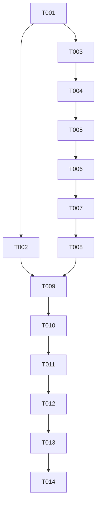

# Tasks: 播放页重新设计（player-redesign）

**Input**: Design documents from `spec/player-redesign/`（spec.md + plan.md）
**Prerequisites**: plan.md (required), spec.md (required for user stories)

**Tests**: 未要求自动化测试，不含测试任务。验证方式为 Verification 阶段构建验证（build-only）。

**Organization**: 任务按用户故事分组；因主体改动集中在同一文件（PlayerOverlay.ets），故事任务按顺序执行（同文件无并行）；服务层任务（T002）可并行。

## Format: `[ID] [P?] [Story] Description`

- **[P]**: 可并行（不同文件、无未完成依赖）
- **[Story]**: 所属用户故事（映射 spec.md）
- 所有路径相对 `entry/src/main/ets/`

## Path Conventions

- 页面：`entry/src/main/ets/pages/PlayerOverlay.ets`
- 服务：`entry/src/main/ets/service/PlayerController.ets`
- 常量：`entry/src/main/ets/service/Constants.ets`
- 颜色资源：`entry/src/main/resources/base|dark/element/color.json`

---

## Phase 1: Setup（现状确认）

**Purpose**: 既有工程，无需脚手架；仅确认基线。

- [x] T001 阅读并确认现状基线：通读 `entry/src/main/ets/pages/PlayerOverlay.ets`（1030行）、`entry/src/main/ets/service/PlayerController.ets`（seek/subscribe/refreshUi 逻辑）、`entry/src/main/ets/service/Constants.ets`（AS_* 键与定时预设）、`spec/player-redesign/plan.md` 的 R1-R10 决策；确认工程存在 `build-profile.json5`，无需 `devecocli create`。

---

## Phase 2: Foundational（阻塞性前置）

**Purpose**: 服务层新方法 + 页面骨架，必须先于所有用户故事完成。

**⚠️ CRITICAL**: 本阶段完成前不得开始用户故事任务。

- [x] T002 [P] 在 `entry/src/main/ets/service/PlayerController.ets` 新增公开方法 `seekBy(offsetMs: number): void`：duration<=0 或未 prepared 直接返回；目标位置 = clamp(currentTime + offsetMs, 0, duration)；立即更新 this.currentTime 并调用 refreshUi()（乐观更新）；实际 player.seek 以约 250ms 防抖合并提交，防抖期内新调用基于最新 currentTime 叠加；不改变既有 seek(ms) 语义、不新增持久化（plan.md R3）。
- [x] T003 重构 `entry/src/main/ets/pages/PlayerOverlay.ets` 的 build() 外层骨架为「固定底栏」结构（plan.md R1）：Column { 顶栏（仅 [▼收起]，删除"正在播放"标题文字与居中 Stack）/ 空态分支（trackIndex<0 && playlistCount===0 时占满剩余空间，隐藏底栏）/ else 分支：Scroll(contentScroller) 信息区容器 .layoutWeight(1) + 固定底栏容器（进度条行/时间行/控制栏/底部操作行/状态行的空占位区块）}；下拉关闭手势判定保留（contentScroller 仍为信息区滚动控制器）。

**Checkpoint**: 骨架可编译；信息区旧内容暂置于 Scroll 内，底栏占位待后续任务填充。

---

## Phase 3: User Story 1 - 沉浸式信息区布局（Priority: P1）🎯 MVP

**Goal**: 居中封面（光晕+右下角原视频按钮）+ 标题行（▼详情箭头）+ UP行 + 播放量/发布时间统计行。

**Independent Test**: 播放曲目打开播放页，信息区四块内容正确展示；点标题行开详情；点封面右下角按钮跳浏览器。

- [x] T004 [US1] 将封面块迁移至信息区 Scroll 内并保持原样：径向光晕（GLOW_* 常量与呼吸动画）、16:9 300×188 封面（无封面 ♪ 占位）、右下角"播放视频"按钮（openOriginal 逻辑）、播放/暂停缩放与亮度动画，全部不动仅归位（spec FR-002、US1 场景1/2/3）。
- [x] T005 [US1] 改造标题行（spec FR-003）：标题（≤2行截断，layoutWeight）+ 行尾 ▼ 小箭头（随 showDetail 旋转），整行点击打开现有 bindSheet 详情半模态；去掉固定行高 52 改自适应；空态无曲目时箭头不显示（US1 场景4）。
- [x] T006 [US1] 迁移 UP 行（头像22圆/首字占位 + UP名 + Blank + n/total 序号）并在其下新增统计行：`播放 {formatCount(trackView)} · {formatPubDate(trackPubdate)}`，次要色 12vp，居中（plan.md R8；数据已有同步，无需改 syncFrom）。

**Checkpoint**: US1 完成后，播放页信息区即为新布局（MVP 可见形态）。

---

## Phase 4: User Story 2 - 细进度条与时间行（Priority: P2）

**Goal**: 细条进度条 + 独立时间行，防回弹保留。

**Independent Test**: 播放中拖动进度条松手 seek 生效；时间行左侧拖拽中实时变化；isPreparing 时进度区禁用。

- [x] T007 [US2] 在固定底栏实现进度区（spec FR-004、plan.md R5）：Slider 移入底栏，`.trackThickness(5)` + `.blockSize(12)`，配色沿用 track_color/primary_color 资源；受控 sliderValue + isSeeking 防回弹逻辑原样迁移；进度条下方独立时间行 Row：左=当前时间（拖拽中显示拖拽位置）、Blank、右=总时长，13vp 次要色；width '92%' 居中。

---

## Phase 5: User Story 3 + User Story 7 - 传输五键控制栏与 ±15s 微调（Priority: P2）

**Goal**: [上一首][◀◀15s][播放/暂停][15s▶▶][下一首] 传输簇，微调固定 15s。

**Independent Test**: 五键各自功能正常；±15s 单击跳 15 秒、连按叠加、边界钳制；isPreparing 时微调禁用。

- [x] T008 [US3] 控制栏重组（spec FR-005）：上一首/播放暂停/下一首三键迁入底栏，保留 popPrev/popPlay/popNext 按压动画、置灰逻辑（playlistCount/isPrepared 门控）与 togglePlay 行为；布局为五键横排居中、播放键 72×72 主按钮居中、其余四键次级。
- [x] T009 [US7] 新增 ◀◀15s / 15s▶▶ 微调按钮（spec FR-013、plan.md R3/R4）：文件级常量 `SEEK_STEP_MS = 15000`；点击调用 `controller.seekBy(±SEEK_STEP_MS)`；isPrepared 为 false 时禁用置灰；图标优先 SymbolGlyph（gobackward/goforward 类系统符号），SDK 无对应资源时降级为文字胶囊（◀ 15s / 15s ▶），保持毛玻璃胶囊风格。

---

## Phase 6: User Story 4 - 底部操作行（Priority: P3）

**Goal**: [倍速][播放模式][定时][队列] 四按钮收纳至控制栏下方。

**Independent Test**: 四按钮分别打开现有浮层/队列且选择生效、按钮文案随状态刷新。

- [x] T010 [US4] 在控制栏下方实现底部操作行（spec FR-006、plan.md R6）：倍速按钮（`倍速 {rateLabel}` 非1.0时 accent 色 → showSpeed 打开现有 speedPanel）、模式按钮（modeLabel → showMode/modePanel）、定时按钮（未开启"定时"/激活显示 formatRemaining 剩余并 accent 色 → showSleepTimer/sleepTimerPanel+sleepTimerPicker）、队列按钮（SymbolGlyph list_bullet 圆形底 → AS_SHOW_QUEUE_SHEET 打开 QueueDrawer）；speedPanel/modePanel/sleepTimerPanel/sleepTimerPicker 四个 @Builder 与 @StorageLink 开关原样复用不动。

---

## Phase 7: User Story 5 - 顶栏精简与入口重排收尾（Priority: P3）

**Goal**: 移除旧次控制行与取消收藏入口；statusMsg/加载指示固定底栏。

**Independent Test**: 全页无"倍速/播放顺序/取消收藏/定时"平铺次控制行残留；无取消收藏入口；statusMsg 任意滚动位置可见。

- [x] T011 [US5] 清理与状态行（spec FR-007/FR-008、plan.md R7/R10）：删除旧次控制行（倍速/模式/取消收藏/定时）与"取消收藏"按钮；删除 @State canUnfavorite 及 syncFrom 中对它的赋值（服务层 unfavoriteCurrent 等保留不动）；在底部操作行下方实现固定状态行：statusMsg（居中、13vp、≤2行截断）+ isPreparing 时小号 LoadingProgress。

---

## Phase 8: User Story 6 - 鸿蒙特色与既有体验保留核查（Priority: P1，横切收尾）

**Goal**: 改版后核查全部保留项无回退。

**Independent Test**: 下拉关闭正常；深浅色渲染正确；空态正常；后台播放不受影响（构建级确认）。

- [x] T012 [US6] 保留项核查与修正（spec FR-009/FR-010）：下拉关闭手势（阈值 80vp + 信息区在顶 + 无浮层打开的 noOverlayOpen 判定）在骨架重组后仍正确；空态引导文案与布局正常；光晕/缩放/按压动画完整；所有颜色均走 base|dark 双份资源键无硬编码；QueueDrawer/speedPanel/modePanel/sleepTimerPanel/sleepTimerPicker/详情 bindSheet 交互正常；确认未改动 PlayerController 既有方法语义（seekBy 为纯新增）。

---

## Phase 9: Polish（横切清理）

**Purpose**: 质量收尾。

- [x] T013 全文件清理自查：对改动文件运行 `arkts_check` 并修复全部诊断；删除残留死代码（未使用的 import/状态/方法）；核对注释与 plan.md 布局蓝图一致；确认 build()/@Builder 内无 ArkTS 违规语法（对象字面量类型、standalone-this 等）。涉及 `entry/src/main/ets/pages/PlayerOverlay.ets`、`entry/src/main/ets/service/PlayerController.ets`。

---

## Phase 10: Verification

<!-- verification_scope: build-only -->

**Purpose**: 构建验证（用户已选择 build-only；模拟机部署测试已按用户决策取消）。

- [x] T014 执行 `devecocli build` 构建工程并修复全部编译错误（迭代 修复→重建 直至成功）。（实现子代理已完成：签名 hap 生成于 2026-10-04 9:06:19，晚于全部源码最后修改 9:05:39）
- [x] T015 【已取消】模拟机部署测试（`devecocli run --skip-build`）按用户决策移除，不执行。

---

## Dependencies & Execution Order

### Phase Dependencies

- **Setup (Phase 1)**: 无依赖，立即开始
- **Foundational (Phase 2)**: 依赖 Setup；**阻塞所有用户故事**
- **User Stories (Phase 3-8)**: 全部依赖 Foundational 完成；因同文件必须串行，按 T004→T012 顺序执行
- **Polish (Phase 9)**: 依赖全部用户故事完成
- **Verification (Phase 10)**: 依赖 Polish 完成

### User Story Dependencies

- **US1 (P1)**: 依赖 T003 骨架（T004→T005→T006 串行）
- **US2 (P2)**: 依赖 US1（信息区定型后底栏自上而下填充）
- **US3+US7 (P2)**: 依赖 US2；US7 另依赖 T002（seekBy）
- **US4 (P3)**: 依赖 US3+US7（控制栏定位后排操作行）
- **US5 (P3)**: 依赖 US4（底栏布局定型后清理旧元素）
- **US6 (P1, 横切)**: 最后执行，核查全部保留项

### Within Each User Story

- 服务方法（T002）先于接入它的 UI（T009）
- 结构骨架先于内容填充
- 旧元素删除（T011）在新布局全部就位后进行

### Dependency Graph



（T015 模拟机部署已按用户决策取消，不在执行链中。）

### Parallel Opportunities

- T002（PlayerController.ets）与 T003-T008（PlayerOverlay.ets）不同文件，可并行；T002 只需在 T009 前完成
- T004-T012 同文件，**不可并行**

## Parallel Example: Foundational

```bash
# 两个任务不同文件，可并行启动：
Task T002: "PlayerController 新增 seekBy（entry/src/main/ets/service/PlayerController.ets）"
Task T003: "PlayerOverlay 骨架重组（entry/src/main/ets/pages/PlayerOverlay.ets）"
```

## Implementation Strategy

### MVP First (T001-T006)

1. 完成 Setup（T001）
2. 完成 Foundational（T002、T003）
3. 完成 US1（T004-T006）
4. **STOP and VALIDATE**: 播放页信息区呈现新布局（封面/标题行/UP行/统计行），详情与原视频可达
5. 此时已可演示核心改版形态

### Incremental Delivery

1. Setup + Foundational → 骨架与 seekBy 就绪
2. +US1 → 信息区新布局（MVP）
3. +US2 → 细进度条+时间行
4. +US3/+US7 → 传输五键与 ±15s 微调
5. +US4 → 底部操作行（倍速/模式/定时/队列）
6. +US5 → 清理旧元素+状态行
7. +US6 → 保留项核查
8. Polish → arkts_check 清理
9. Verification → 构建+部署

## Notes

- 总任务数 15（T001-T015，其中 T015 已按用户决策取消，实际执行 T001-T014）；按故事分布：Setup 1 / Foundational 2 / US1 3 / US2 1 / US3 1 / US7 1 / US4 1 / US5 1 / US6 1 / Polish 1 / Verification 1（仅构建，无部署）
- [P] 任务 = 不同文件、无未完成依赖（仅 T002 满足）
- [Story] 标签映射 spec.md 用户故事，保证可追溯
- 每个故事的 Checkpoint 即 spec.md 对应 Acceptance Scenarios，可独立验证
- **执行顺序强调**: T004-T012 严格按 ID 顺序串行执行（同一文件），不得乱序
- 单人执行场景：全程顺序执行即可，无需并行调度
