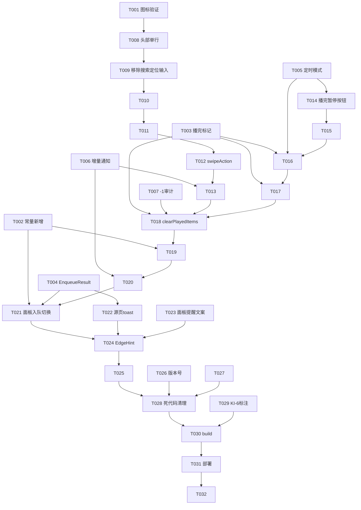

# Tasks: 播放列表重做（队列抽屉精简重构 + 睡眠定时播完暂停）

**Input**: Design documents from `spec/queue-redesign/`
**Prerequisites**: plan.md (required), spec.md (required for user stories)
**Tests**: 未要求自动化测试；验证走 arkts_check + devecocli build + 模拟器 UI 验证（KI-6 真机验证欠账另行安排）
**Organization**: 任务按用户故事分组；故事阶段按优先序排列（US1→US2→US3→US4→US6→US5→US7，P2 的 US6 先于 P3 的 US5/US7 执行）

## Format: `[ID] [P?] [Story] Description`

- **[P]**: 可并行（不同文件、无未完成依赖）
- **[Story]**: 所属用户故事（US1-US7，映射 spec.md）

## Path Conventions

- 源码根：`entry/src/main/ets/`（单模块工程）
- 文档：`PROJECT_NOTES.md`、`README.md`（仓库根）；`AppScope/app.json5`

---

## Phase 1: Setup (Shared Infrastructure)

**Purpose**: 实现前置的图标与常量准备

- [x] T001 [P] 在本机 SDK 的 sysResource.js（路径见 AGENTS.md）中逐一验证图标 symbol 存在性并确定映射：清除已播（对勾/清扫语义，与 trash 视觉区分）/ 多选与全选（checklist 系）/ 清空与删除（trash 系）/ 移除所选 / 返回（chevron_left）；不存在者就近替换（plan R9）
- [x] T002 [P] 在 `entry/src/main/ets/service/Constants.ets` 新增本轮所需常量（入队 toast 三分型文案、清除已播确认框文案、无已播 toast 文案等；失效键清理归 T028 不在本任务）

**Checkpoint**: 图标映射与文案常量就绪，后续故事直接引用

---

## Phase 2: Foundational (Blocking Prerequisites)

**Purpose**: 服务层基础设施——所有用户故事的前置；完成前不得开始任何故事

- [x] T003 在 `entry/src/main/ets/service/PlayerController.ets` 新增 `currentItemEnded` 播完状态标记：默认 false、随 emitUi 广播、在 playIndex/seek/playRequest 等重新开播路径清除（plan R3；置位点在 T016/T017）
- [x] T004 在 `entry/src/main/ets/service/PlayerController.ets` 新增 `EnqueueResult` 枚举（APPENDED/STARTED/DUPLICATE/FAILED）与 `addSingleVideo(bvid)` 方法（取详情后委托 loadPlaylistAndPlay），`loadPlaylistAndPlay` 返回类型 void → EnqueueResult、行为不变（plan R5）
- [x] T005 [P] 在 `entry/src/main/ets/service/SleepTimerController.ets` 新增 `SleepTimerMode` 三态（NONE/COUNTDOWN/PLAY_TO_EOF）与 `armPlayToEof`/`disarmPlayToEof`；startTimer 与 arm 互斥（后选取代先选）、cancelTimer 清全部、active 扩展为任一模式、onTimerExpired 仅 COUNTDOWN 触发（plan R4/R12）
- [x] T006 [P] 在 `entry/src/main/ets/component/QueueSheet.ets` 的 `PlaylistDataSource` 镜像 HistoryDataSource 增补 `notifyDataDelete(index)` 增量通知（plan R7）
- [x] T007 [P] 全局审计 `currentIndex` 消费点（`entry/src/main/ets/component/MiniPlayer.ets`、`pages/PlayerOverlay.ets`、`service/MediaSession.ets`、`component/QueueSheet.ets`），对 `currentIndex=-1 且队列非空` 的新状态补越界守卫（plan R2；PlayerOverlay 已有 trackIndex<0 兜底，重点 MiniPlayer/MediaSession）

**Checkpoint**: 服务层就绪，用户故事可按序开工

---

## Phase 3: User Story 1 - 队列头部精简为单行图标（Priority: P1）🎯 MVP

**Goal**: 队列抽屉头部收敛为「播放队列 (N) + 清除已播/多选/清空三图标」单行；移除搜索/定位/BV 输入行；保留多选/渐变模糊/当前高亮
**Independent Test**: 打开队列抽屉验证头部形态、被移除功能缺席、保留项无回归

- [x] T008 [US1] 重写 `entry/src/main/ets/component/QueueSheet.ets` 头部为单行布局：左侧「播放队列 (N)」粗体标题（样式对齐 SettingsPage.playHistoryPanel 标题）、右侧清除已播/多选/清空三 SymbolGlyph 图标按钮（T001 映射，危险语义用 danger_red）；空队列时三入口隐藏或不可用（FR-001/FR-003/FR-013）
- [x] T009 [US1] 从 `entry/src/main/ets/component/QueueSheet.ets` 移除搜索浮层（searchPanel/doSearch/playSearchResult/搜索三状态）、定位链路（locateCurrent/flashIndex/flashTimer/定位按钮）、BV 输入行（bvInput/addMsg/addByBv/添加并播放按钮）的全部 UI 与状态（FR-002；对应 service 方法清理归 T028）
- [x] T010 [US1] 调整 `entry/src/main/ets/component/QueueSheet.ets` 空态文案（移除「输入BV号」引导，改为前往订阅源/首页「＋」引导）并确认渐变模糊分区（listBlurStops/contentStartOffset）随精简后头部高度自适应（FR-007/FR-013）
- [x] T011 [US1] 在 `entry/src/main/ets/component/QueueSheet.ets` 将多选操作行（全选/移除所选(N)/返回）改为图标按钮（移除所选数量以图标旁小字号数字呈现），确认长按进入/竖向滑动连选/勾选能力无回归（FR-006/FR-011/FR-012）

**Checkpoint**: US1 独立可验——头部形态与保留项回归

---

## Phase 4: User Story 2 - 左滑删除单条（Priority: P1）🎯 MVP

**Goal**: 队列条目左滑露出删除按钮、点击执行；与长按多选手势共存
**Independent Test**: 队列 ≥2 条时左滑删除任一条目，与长按多选交叉操作

- [x] T012 [US2] 在 `entry/src/main/ets/component/QueueSheet.ets` 为列表条目挂 `swipeAction({ end: 删除按钮 builder })`，按钮样式对齐 SettingsPage.historyDeleteAction（危险色、点击执行、不做阈值直删）（FR-004，plan R6）
- [x] T013 [US2] 在 `entry/src/main/ets/component/QueueSheet.ets` 接通删除执行：按 bvid 调 PlayerController.removeSelectedFromPlaylist([bvid])（沿用含当前条目自动切播的既有语义，FR-010）、selectedBvids 同步剔除、PlaylistDataSource.notifyDataDelete 增量刷新（FR-005/FR-010，plan R7；若多选态手势冲突则降级为多选态禁用左滑并在报告说明——spec Assumptions 降级预案）

**Checkpoint**: US2 独立可验——左滑删除 + 手势共存

---

## Phase 5: User Story 3 - 睡眠定时「播完暂停」（Priority: P2）

**Goal**: 定时面板新增「播完暂停」选项；当前条目播完停原条目暂停；手动操作解除
**Independent Test**: 播放中选「播完暂停」，拖至末尾等播完，验证停原条目/暂停/手动解除三步

- [x] T014 [US3] 在 `entry/src/main/ets/pages/PlayerOverlay.ets` 的 sleepTimerPanel preset 行内（「自定义」之后）追加「播完暂停」按钮：点击调 SleepTimerController.armPlayToEof、PLAY_TO_EOF 激活时高亮、再次点击取消；「取消定时」按钮对两模式通用（cancelTimer）（FR-016，plan R11）
- [x] T015 [US3] 在 `entry/src/main/ets/pages/PlayerOverlay.ets` 的 syncSleepTimer 按模式区分：剩余时间数字仅 COUNTDOWN 显示，PLAY_TO_EOF 仅 timer 入口图标高亮（plan R11）
- [x] T016 [US3] 在 `entry/src/main/ets/service/PlayerController.ets` 的 handleCompleted 扩展：自动切歌分支之前查询 PLAY_TO_EOF——命中则一次性解除（disarm）、置 currentItemEnded=true、设状态文案、return 停在原条目；手动切歌/点选条目经既有 playIndex 路径自然解除（FR-017，plan R4）
- [x] T017 [US3] 在 `entry/src/main/ets/service/PlayerController.ets` 的 handleCompleted 自然播完停止分支（顺序到末集/倒序回首集）置 currentItemEnded=true（FR-018 状态判定的自然播完来源，plan R3）；确认播完暂停后手动继续播放从头重播（completed 态 play 语义，spec US3 场景 6）

**Checkpoint**: US3 独立可验——播完暂停三步 + 模式互斥

---

## Phase 6: User Story 4 - 清除已播（Priority: P2）

**Goal**: 头部「清除已播」图标——移除当前条目前缀；播完状态当前条目随清；二次确认；空结果 toast
**Independent Test**: 播放队列中部某条后点清除已播（播放中/播完暂停两态），验证移除范围与播放连续性

- [x] T018 [US4] 在 `entry/src/main/ets/service/PlayerController.ets` 实现 `clearPlayedItems(): Promise<void>`：移除 [0, currentIndex) 前缀；currentItemEnded 时连当前条目一并移除——队列空走既有清空分支，非空置 currentIndex=-1 + isPrepared/isPlaying=false + resetPlayer + 持久化(playlist, -1, 0)；播放中场景仅移前缀、索引前移、不打断；playlistVersion++ + emitUi（FR-009/FR-010，plan R1/R2）
- [x] T019 [US4] 在 `entry/src/main/ets/component/QueueSheet.ets` 接通清除已播入口：可用性判定（currentIndex>0 或 currentItemEnded）、无可清时 toast（T002 文案）不弹框、可清时 AlertDialog 二次确认（取消/遮罩不变）、确认后调 clearPlayedItems（FR-009）
- [x] T020 [US4] 在 `entry/src/main/ets/component/QueueSheet.ets` 为清除已播结果做本地增量同步：确认前记录移除范围，调用后对 items/@State 与 PlaylistDataSource 从高索引向低索引 notifyDataDelete（避免索引左移错位），不整表 reload（spec Edge Cases，plan R7）；清除后剩余队列点击条目正常开播（spec US4 场景 6）

**Checkpoint**: US4 独立可验——两态清除范围 + 播放连续性 + toast

---

## Phase 7: User Story 6 - 单视频入队统一收敛与反馈（Priority: P2）

**Goal**: 添加订阅面板单视频改「追加不打断」；两路径 toast 分型反馈；面板补提醒文案
**Independent Test**: 播放中经添加面板输入另一 BV 提交，验证不打断 + toast；源详情点单集交叉验证一致

- [x] T021 [US6] 在 `entry/src/main/ets/pages/AddSubscriptionSheet.ets` 将 playBv 改调 PlayerController.addSingleVideo：按 EnqueueResult toast 三分型（已加入队列/开始播放/已在队列中，T002 文案）、移除 goToPlayerTab 自动唤起播放层；av 号/短链链路经 playBv 自动继承（FR-020/FR-021，plan R5）
- [x] T022 [P] [US6] 在 `entry/src/main/ets/pages/SourcePage.ets` 为 playEpisode 接 loadPlaylistAndPlay 返回结果 toast 同款分型；playAll 行为不动（FR-021）
- [x] T023 [P] [US6] 在 `entry/src/main/ets/pages/AddSubscriptionSheet.ets` 输入框下方常驻说明行（现有「支持分享文案、短链、BV 号、av 号、UP 主 UID」处）追加「单视频将加入播放列表，不打断当前播放」语义文案（FR-019）

**Checkpoint**: US6 独立可验——两路径行为与反馈一致

---

## Phase 8: User Story 5 - 队列边缘提醒接入（Priority: P3）

**Goal**: 队列列表拉过底显示「已经到底了」，回弹消失
**Independent Test**: 队列超一屏时滚到底继续上拉

- [x] T024 [US5] 在 `entry/src/main/ets/component/QueueSheet.ets` 列表外层包 Stack 接入 EdgeHint（bottom、「已经到底了」），可见性由 onWillScroll/onScrollStop + listScroller.currentOffset 边界判定驱动，逐行对齐 SettingsPage 历史面板模式（FR-008，plan R8）

**Checkpoint**: US5 独立可验——与既有三列表行为一致

---

## Phase 9: User Story 7 - 登记收尾与版本号更新（Priority: P3）

**Goal**: PROJECT_NOTES 销项 + 版本号升级
**Independent Test**: 检查 PROJECT_NOTES 条目与 app.json5

- [x] T025 [P] [US7] 更新 `PROJECT_NOTES.md`：KI-3 队列左滑删除销项、round6 队列边缘提醒销项、「addByBv 追加不打断」规划标记已实现（经添加订阅面板收敛）、KI-6 补播完暂停模式（注明模拟器已验、真机验证欠账）、「版本号更新」销项（FR-014）
- [x] T026 [P] [US7] 将 `AppScope/app.json5` 版本号升至 0.2.0/2000（plan R13）
- [x] T027 [P] [US7] 核对 `README.md` 功能描述：队列搜索/BV 添加行描述因功能移除失准则同步更新，不新增版本号回填（FR-014 关联）

**Checkpoint**: 登记与版本号就绪

---

## Phase 10: Polish & Cross-Cutting Concerns

**Purpose**: 死代码清理与标注收尾（依赖全部故事完成）

- [x] T028 在 `entry/src/main/ets/service/PlayerController.ets` 与 `entry/src/main/ets/service/Constants.ets` 执行死代码清理：addToPlaylist（已被 addSingleVideo 取代，两个旧调用方均移除）/ addManyToPlaylist / searchLibrary / playFromLibraryResult / goToPlayerTab（旧调用方已移除，删前复核）/ AS_SHOW_SEARCH、SEARCH_MAX_INPUT_LEN 等失效键；**每项删除前全局检索确认零引用**（FR-015，plan R10）
- [x] T029 [P] 更新 `entry/src/main/ets/service/SleepTimerController.ets` 文件头 `[UNVERIFIED 2026-10]` 标注：补充播完暂停模式说明与验证状态（模拟器已验/真机欠账），真机验证通过条件保持

**Checkpoint**: 代码路径零残留

---

## Phase 11: Verification

<!-- verification_scope: build+ui -->
<!-- verification_note: UI 验证仅在模拟器/虚拟机执行；KI-6 睡眠定时真机验证为遗留欠账，不在本轮闭环 -->

**Purpose**: 构建、部署（模拟器）与逐故事 UI 验证

- [x] T030 对本轮全部改动 .ets 文件运行 `arkts_check`，零错误后执行 `devecocli build`，按编译错误迭代修复直至通过（最多 1 初始 + 9 轮修复）
- [ ] T031 执行 `devecocli run --skip-build` 部署到模拟器
- [ ] T032 在模拟器上逐用户故事运行 UI 验证（verify_ui）：US1 头部形态/功能缺席/保留项、US2 左滑删除/手势共存、US3 播完暂停三步/模式互斥、US4 两态清除/toast/确认框、US6 追加不打断/两路径 toast/提醒文案、US5 底部边缘提醒、US7 版本号；每个故事最多 1 初验 + 2 修复复验

---

## 📊 Dependency Graph



## ⚡ Parallel Execution Guide

| Phase | Tasks | Required Files | Execution Notes |
|---|---|---|---|
| Setup | T001, T002 | sysResource.js（只读）、Constants.ets | 互不依赖可并行 |
| Foundational | T003+T004 串行；T005/T006/T007 并行 | PlayerController.ets / SleepTimerController.ets / QueueSheet.ets / MiniPlayer 等审计点 | T003/T004 同文件须串行；其余不同文件可并行 |
| US1 | T008→T009→T010→T011 | QueueSheet.ets | 同文件严格串行 |
| US3 | T014→T015 与 T016→T017 两条线 | PlayerOverlay.ets / PlayerController.ets | 跨文件两线可并行，线内串行 |
| US6 | T021 与 T022/T023 并行 | AddSubscriptionSheet.ets / SourcePage.ets | 不同文件可并行 |
| US7 | T025/T026/T027 全并行 | PROJECT_NOTES.md / app.json5 / README.md | 不同文件无依赖 |
| Polish | T028 与 T029 并行 | PlayerController+Constants / SleepTimerController | T028 须在全部故事后执行 |

## Dependencies & Execution Order

### Phase Dependencies

- **Setup (Phase 1)**: 无依赖，立即开始
- **Foundational (Phase 2)**: 依赖 Setup；**阻塞全部用户故事**
- **User Stories (Phase 3-9)**: 均依赖 Foundational 完成；按优先序执行（US1→US2→US3→US4→US6→US5→US7），QueueSheet 相关故事（US1/US2/US4/US5）同文件严格串行
- **Polish (Phase 10)**: 依赖全部故事完成（死代码清理前置条件是调用方已全部移除/切换）
- **Verification (Phase 11)**: 依赖 Polish 完成

### User Story Dependencies

- **US1 (P1)**: Foundational 后即可开始；是 US2/US4/US5 的宿主（同文件）
- **US2 (P1)**: 依赖 US1（列表结构定型）+ T006
- **US3 (P2)**: 依赖 T003/T005；与 US1/US2 跨文件可并行
- **US4 (P2)**: 依赖 US2（清除入口挂新头部）+ US3（currentItemEnded 置位链路）+ T007
- **US6 (P2)**: 依赖 T002/T004；跨文件独立
- **US5 (P3)**: 依赖 US1（列表容器定型）
- **US7 (P3)**: 依赖全部功能故事完成（销项登记以实现为准）

### Within Each User Story

- 服务层（PlayerController/SleepTimerController）先于 UI 接线
- QueueSheet 内任务按 布局→交互→数据同步 排序
- 每故事完成后可在模拟器独立自验（Checkpoint）

## Parallel Example

```text
# Foundational 并行组（不同文件）：
Task T003+T004: PlayerController.ets（串行线）
Task T005: SleepTimerController.ets
Task T006: QueueSheet.ets（PlaylistDataSource）
Task T007: MiniPlayer/MediaSession 审计

# US3 并行组：
Task T014→T015: PlayerOverlay.ets（定时面板 UI 线）
Task T016→T017: PlayerController.ets（完播钩子线）

# US6/US7/Polish 并行组：
Task T021/T023: AddSubscriptionSheet.ets
Task T022: SourcePage.ets
Task T025/T026/T027: PROJECT_NOTES.md / app.json5 / README.md
Task T029: SleepTimerController.ets（标注）
```

## Implementation Strategy

### MVP First (US1 + US2 Only)

1. 完成 Setup + Foundational
2. 完成 US1（头部精简）→ 模拟器独立验证
3. 完成 US2（左滑删除）→ 模拟器独立验证 —— **MVP 交付点**
4. 部署体验，确认风格方向后再推进后续故事

### Incremental Delivery

1. Setup + Foundational → 服务层就绪
2. US1 → US2 → **MVP**（核心风格重构 + 删除交互）
3. US3 → US4（播完暂停 + 清除已播，睡眠定时域闭环）
4. US6（单视频收敛与反馈，独立域）
5. US5 → US7 → Polish → Verification（体验补齐 + 收尾）

### Constraints

- **本轮仅规划不实施**：实现轮待另一会话 bug 修完后启动；启动前须拉取最新代码基线（另一会话改动 PROJECT_NOTES/Constants/PlayerOverlay/PlayerController 等同域文件，存在合并冲突风险，实现前先 diff）
- 单人顺序执行为主，[P] 任务供并行提效

## Notes

- [P] 任务 = 不同文件且无未完成依赖
- [Story] 标签映射 spec.md 用户故事，可追溯
- 每个故事独立可验（见各 Checkpoint），可随时暂停验证
- 实现遵循 AGENTS.md 编码原则：Constants 唯一真相源、禁 any/unknown/as、`[API24-COMPAT]` 守卫不删、代码零注释（ponytail: 标注除外）
- 图标引用前必须在 sysResource.js 确认存在（T001 已前置）
- KI-6 真机验证为遗留欠账：T032 模拟器验证通过不代表 KI-6 销项，仅更新标注状态（T029）
- **R7/R8 基线适配（2026-10-09 核对）**：核心计划零冲突，实现轮注意以下事项——
  1. 样式锚点 `playHistoryPanel`/`historyDeleteAction` 已随 R7 系统风格重写（方法/面板仍在 SettingsPage），T008/T012/T024 对齐以工作区现行代码为准，即自动对齐新风格
  2. T001 清除已播图标选型须与源页「已播 = 绿色圆圈对钩」标记（R7⑤）视觉区分
  3. PlayerController 新增 wifiNow/isWifiNow 与 US9 锁屏时长重推（onPrepared 内 updateTrack force）；T007 审计 MediaSession 时注意 updateTrack 新签名（含 force 参数/lastDurationMs），T016/T017 改 handleCompleted 不得干扰 US9 逻辑
  4. QueueSheet 条目封面已接无图模式（dataSaver 判断），T008-T013 重构时保留
  5. 历史面板 EdgeHint 已双向（到顶+到底，R7④），队列按 spec 仅底部（FR-008 不变），实现模式对齐即可
  6. T027 核对范围缩小：README 版本小节已移除且登记「不再回填」，仅核对功能描述无失准
  7. `spec/feature.json` 现被 R8 会话覆盖指向 `spec/ux-feedback-round8`——队列实现轮启动时切回 `spec/queue-redesign`（本轮规划工件目录 `spec/queue-redesign/` 完好）
