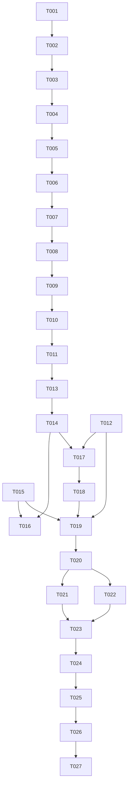

# Tasks: 第二轮体验反馈批次（ux-feedback-round2）

**Input**: Design documents from `spec/ux-feedback-round2/`（spec.md + plan.md）
**Prerequisites**: plan.md (required), spec.md (required for user stories)

**Tests**: 未要求自动化测试，不含测试任务。验证方式为 Verification 阶段构建 + 模拟器 UI 验证（build+ui）。

**Organization**: 任务按用户故事分组。执行顺序为用户强约束：**US1 订阅修复 → 其余故事（US3-US9）→ git 基线提交 → US2 流式播放压轴 → 验证**。主体改动集中在 PlayerOverlay.ets，同文件任务严格按 ID 顺序串行；不同文件的少量任务标 [P] 可并行。

## Format: `[ID] [P?] [Story] Description`

- **[P]**: 可并行（不同文件、无未完成依赖）
- **[Story]**: 所属用户故事（映射 spec.md）
- 所有路径相对 `entry/src/main/ets/`（路由表资源除外）

## Path Conventions

- 播放页：`entry/src/main/ets/pages/PlayerOverlay.ets`
- 队列组件：`entry/src/main/ets/component/QueueSheet.ets`
- 服务层：`entry/src/main/ets/service/{BiliService,AudioPlayer,PlayerController,Appearance}.ets`
- 页面：`entry/src/main/ets/pages/{HomePage,SettingsPage,AddSubscriptionSheet,SourcePage,MorePage}.ets`
- 路由表：`entry/src/main/resources/base/profile/router_map.json`

---

## Phase 1: Setup（现状确认）

**Purpose**: 既有工程，无需脚手架；确认基线。

- [X] T001 阅读并确认现状基线：通读 `entry/src/main/ets/service/BiliService.ets`（fetchUpInfo/fetchUpVideos/fetchDashAudioCandidates/checkJsonBody）、`service/AudioPlayer.ets`（fdSrc 链路）、`service/PlayerController.ets`（playIndex/init/persistProgress）、`service/Appearance.ets`（accentColor 持久化）、`pages/PlayerOverlay.ets`（上一轮重设计后现状）、`pages/HomePage.ets`（顶栏/弹菜单）、`pages/SettingsPage.ets`（playHistoryPanel/自动播放开关）、`component/QueueSheet.ets`、`spec/ux-feedback-round2/plan.md` 的 R1-R12 决策；确认工作区有上一轮未提交改动（git status）。

---

## Phase 2: User Story 1 - 可靠订阅 UP 主（Priority: P1）🎯 最先实现

**Goal**: acc/info 风控重试/降级 + 真实错误码透出，修复两个掩盖根因的缺陷。

**Independent Test**: 用此前失败的 mid（3690981392124599、278761367）订阅可成功或提示含真实错误码。

- [X] T002 [US1] 改造 `entry/src/main/ets/service/BiliService.ets` 的 fetchUpInfo：移植 fetchUpVideos 的多轮降级模式——最多 3 轮循环，每轮先 WBI 签名 acc/info、失败后 card 接口兜底；错误分类：-352/-412/非 JSON 风控页为可重试（重置 buvid + 指数退避后进下一轮），-404/-400/-101 等为不可重试（立即失败）；全部轮次失败时抛出最后一轮的真实错误（含错误码），不再恒定抛"查询失败"。
- [X] T003 [US1] 修复 `entry/src/main/ets/service/BiliService.ets` 的 fetchUpVideos 错误透出：每轮重试将真实错误（含 code）记录到 lastError（修复初始化后永不赋值、恒报 unknown 的缺陷）；checkJsonBody 抛出的风控页错误视为可重试错误纳入降级链（触发 buvid 重置重试），不再一次即中断。
- [X] T004 [US1] 订阅入口错误提示带真实原因：`entry/src/main/ets/pages/AddSubscriptionSheet.ets` 查询失败 toast 文案附带错误信息（如"查询UP主失败(-352)，疑似风控"）；`entry/src/main/ets/pages/HomePage.ets` 与 `entry/src/main/ets/pages/SourcePage.ets` 刷新失败 toast 保留 err.message 透出（T003 修复后自然显示真实错误码，核对文案格式即可）。

**Checkpoint**: 订阅全链路（查询→添加→刷新）遇风控可重试降级，失败提示含真实错误码。

---

## Phase 3: User Story 3 - 主题色接入与留白铺满（Priority: P1）

**Goal**: 播放页全部着色点运行时跟随 accentColor；信息区内容拉开铺满。

**Independent Test**: 设置页六色板切换后播放页整体变色；目测信息区分布均匀无大片空白。

- [X] T005 [US3] 在 `entry/src/main/ets/service/Appearance.ets` 新增主题色衍生色纯函数（hexWithAlpha）：输入 6 位 hex 主题色与 alpha（0-1 或 0-255，实现时统一），输出 8 位 ARGB 十六进制字符串；带输入容错（非法 hex 回退默认色）。作为全工程衍生色计算唯一入口。
- [X] T006 [US3] `entry/src/main/ets/pages/PlayerOverlay.ets` 主题色全量接入：新增 `@StorageProp('accentColor')`（string，默认 Constants.ACCENT_DEFAULT）；将全部编译期粉色资源引用替换为运行时取色——进度条 selectedColor/blockColor、播放键底色（原 material_tint 的 alpha）、底部操作行与面板激活态文字、倍速/模式面板选中项、定时确定按钮、LoadingProgress、封面光晕 halo 梯度（运行时以主题色+原 alpha 序列计算）、播放键阴影（原 shadow alpha）、♪占位与头像兜底着色；深浅色模式 alpha 沿用现有资源键取值。
- [X] T007 [US3] `entry/src/main/ets/pages/PlayerOverlay.ets` 信息区留白铺满：Scroll 内根 Column 增加 `constraintSize({ minHeight: '100%' })` + `justifyContent(FlexAlign.SpaceBetween)`，内容不足一屏时自动拉开分布；移除封面固定 top margin 32 改由分布接管（保留小基础间距）；内容超出仍可滚动、下拉关闭手势不受影响（contentScroller 在顶判定不变）。

**Checkpoint**: 切主题色播放页即时整体变色（深浅色均验证）；信息区内容铺满无大片空白。

---

## Phase 4: User Story 4 - 图标化与详情交互修正（Priority: P2）

**Goal**: 全部文字按钮图标化；箭头加大热区扩大；下滑关闭箭头即时反转；队列「完成」按钮移除。

**Independent Test**: 播放页无纯文字控制按钮、功能零回退；下滑详情箭头随手势即时转回；队列遮罩关闭正常。

- [X] T008 [US4] `entry/src/main/ets/pages/PlayerOverlay.ets` 传输区图标化：上一首/下一首改 SymbolGlyph（backward_end/forward_end 类系统符号，SDK 缺资源降级文字胶囊）；播放/暂停主键文字 Button 改为 SymbolGlyph 图标按钮（play/pause 填充符号），保留 72×72、毛玻璃底色、阴影、popPlay 缩放动画与 isPrepared 置灰门控。
- [X] T009 [US4] `entry/src/main/ets/pages/PlayerOverlay.ets` 底部操作行图标化：倍速按钮改"仪表类符号+速率短文字（如 1.5x）"；播放模式按钮改四模式映射符号（随机=shuffle 类、单曲循环=repeat_1 类、顺序/倒序取循环箭头类符号，实现时按 SDK 符号表确认，缺资源降级文字）；定时按钮改时钟类符号+激活态剩余时间短文字；队列按钮维持现状（已是图标）；保留 btn_glass 毛玻璃胶囊风格、激活态 accent 着色与点击行为。
- [X] T010 [US4] `entry/src/main/ets/pages/PlayerOverlay.ets` 封面右下角"播放视频"按钮图标化：改播放矩形类 SymbolGlyph+短文字"视频"（或纯符号），保留 openOriginal 跳转行为与毛玻璃底。
- [X] T011 [US4] `entry/src/main/ets/pages/PlayerOverlay.ets` 箭头修正：▼ 图标 fontSize 12→16、外层热区扩大至约 40×40vp（padding 扩大），整行点击打开行为保留；箭头旋转角度改绑独立 @State（不直接绑 showDetail）；bindSheet 增加 shouldDismiss 回调（API 12+）——手势下滑判定通过时立即翻转箭头状态并调用 dismiss，遮罩/其他关闭路径同步即时翻转。
- [X] T012 [P] [US4] `entry/src/main/ets/component/QueueSheet.ets` 移除顶栏「完成」按钮（Button('完成') 整块删除）；确认遮罩点击关闭（QueueDrawer）与多选/清空等其余顶栏按钮不受影响。

**Checkpoint**: 播放页与队列全部控制按钮图标化，交互零回退。

---

## Phase 5: User Story 5 - 播放键缓冲弧线动画（Priority: P2）

**Goal**: 缓冲中播放键外圈弧线旋转，完成后淡入常驻低透明圆环。

**Independent Test**: 点播未缓存曲目观察弧线旋转→出声后变常驻圆环；seek 再缓冲弧线重现。

- [X] T013 [US5] `entry/src/main/ets/pages/PlayerOverlay.ets` 弧线动画：播放键外扩约 88×88vp Stack 区域——isPreparing && playWhenReady 时渲染弧线组件（ProgressType.Arc 或 Path 弧，颜色走 T006 主题色链路）并持续 360° 旋转动画；缓冲结束弧线淡出、同位置淡入低透明度（约 0.15-0.25 alpha 主题色）完整圆环常驻；再次缓冲弧线重现；过渡用 animateTo，不阻塞播放键点击。

**Checkpoint**: 加载动画完整呈现"旋转弧线→常驻装饰圆环"生命周期。

---

## Phase 6: User Story 6 - 详情简介懒加载（Priority: P2）

**Goal**: 打开详情时为空简介后台拉取并即时刷新。

**Independent Test**: 未播放过的订阅曲目开详情，简介区从占位自动填充。

- [X] T014 [US6] `entry/src/main/ets/pages/PlayerOverlay.ets` 简介懒加载：打开详情入口处（置 showDetail=true 的所有路径）检查 trackDesc 为空且 trackBvid 非空时，调用既有 `BiliService.fetchVideoInfo(bvid)` 取 desc 回填 trackDesc（@State 驱动简介区自动刷新）；加成员标志防并发重复拉取；失败静默保留"暂无简介"占位（无 toast）；已有简介不发起请求。

**Checkpoint**: 详情简介对订阅源未播放曲目可自动填充。

---

## Phase 7: User Story 7 - 独立"更多"页与首页直达（Priority: P2）

**Goal**: 新建 MorePage 路由页收纳三入口；首页右上角加大直达。

**Independent Test**: 首页右上角直达更多页；三入口分别可达设置/历史/关于且返回链完整。

- [X] T015 [P] [US7] 新建 `entry/src/main/ets/pages/MorePage.ets`：NavDestination 根节点页面，列表三项入口（设置/播放历史/关于），点击分别 `pushPathByName('settingsPage', 'playHistory'/'about' 等参数)`（复用既有参数直开机制，设置项传空参数）；页面导出 @Builder 构建函数；在 `entry/src/main/resources/base/profile/router_map.json` 注册 morePage 条目（若工程尚无路由表则新建并确认 module.json5 挂载）；样式遵循工程现有列表风格（深浅色资源键）。
- [X] T016 [US7] `entry/src/main/ets/pages/HomePage.ets` 右上角改造：ellipsis_circle 按钮 34×34→40×40（SymbolGlyph 18→22）；onClick 改为直接 pushPathByName('morePage')；删除 morePopupContent @Builder 与 bindPopup 弹菜单及 showMoreMenu 状态；左上角 + 按钮同步 40×40 保持对称（bindSheet 添加订阅行为不变）。

**Checkpoint**: 弹菜单退役，更多页直达且三入口可用。

---

## Phase 8: User Story 8 + 9 - 历史页背景与启动行为（Priority: P3）

**Goal**: 播放历史 bindSheet 化与详情一致；自动播放默认关；恢复文案移除。

**Independent Test**: 浅色下历史与详情背景观感一致；未设置用户启动不自动播、无恢复文案。

- [X] T017 [P] [US8] `entry/src/main/ets/pages/SettingsPage.ets` 播放历史改 bindSheet：playHistoryPanel 从全屏 Stack 覆盖层改为 bindSheet 呈现（height '62%'、backgroundColor sheet_background、dragBar、preferType BOTTOM，与播放页详情 Sheet 同构）；面板内容与既有逻辑（列表/清空/状态行）原样迁移；'playHistory' 参数直开机制保留（收到参数置 sheet 开关为真）；取消收藏历史面板（historyPanel）不动。
- [X] T018 [US9] 启动行为调整：`entry/src/main/ets/service/PlayerController.ets` 自动播放默认值 getNumber(KEY_AUTO_PLAY_ON_START, 1→0) 并删除恢复进度时"已恢复上次进度，点击播放继续"的 statusMsg 赋值（恢复能力 lastIndex/lastPosMs 与自动播放开启时的"自动继续播放上次进度"文案保留）；`entry/src/main/ets/pages/SettingsPage.ets` 设置页开关读取默认值同步改 0。

**Checkpoint**: 历史页与详情观感一致；默认启动行为符合 FR-018/FR-019。

---

## Phase 9: Polish（非流式改动收尾）

**Purpose**: 质量收尾，git 提交前完成。

- [X] T019 对本轮全部非流式改动文件运行 `arkts_check` 并修复全部诊断：`service/BiliService.ets`、`service/Appearance.ets`、`pages/PlayerOverlay.ets`、`pages/HomePage.ets`、`pages/SettingsPage.ets`、`pages/MorePage.ets`、`component/QueueSheet.ets`、`service/PlayerController.ets`；删除残留死代码（未使用 import/状态/方法，如 showMoreMenu）；核对 build()/@Builder 内无 ArkTS 违规语法；核对新增颜色均为运行时衍生或资源键引用、无硬编码色值。

---

## Phase 10: Git 基线提交（用户强约束的分水岭）

**Purpose**: 全部非流式改动整体入库，为流式改造提供可回退基线。

- [ ] T020 执行 git 提交：`git add -A` 暂存全部改动（上一轮 player-redesign 的 PlayerOverlay/PlayerController 改动 + spec/ 文档 + 本轮 T002-T019 全部非流式改动），`git commit` 使用简洁中文提交信息（概述：播放页重设计 + 第二轮体验优化非流式部分）。提交前核对 `git status` 无意外文件（构建产物等不入库）。提交后才允许开始流式相关代码修改。

---

## Phase 11: User Story 2 - 音频流式边下边播（Priority: P1）⏳ 压轴最后实现

**Goal**: 未缓存曲目直链流式秒开，缓存优先本地播放，失败重试，下载整段链路退役。

**Independent Test**: 清缓存点播长音频数秒出声；缓存曲目秒播；seek 即时；断网重试后提示且队列完好。

- [ ] T021 [P] [US2] `entry/src/main/ets/service/BiliService.ets` 新增 resolveAudioUrl(bvid: string): Promise<string[]>：复用 fetchVideoInfo 取 cid 与 fetchDashAudioCandidates 的 URL 收集/mcdn 过滤逻辑，返回直链+备选列表（dash 优先，fetchDurlCandidates 的 durl 兜底），不做任何下载；音轨选择沿用现有最高/最低逻辑（preferLowBitrate 开关）。
- [ ] T022 [P] [US2] `entry/src/main/ets/service/AudioPlayer.ets` 新增远程流式数据源：用 media.createMediaSourceWithUrl(url, { 'Referer': 'https://www.bilibili.com', 'User-Agent': <现有桌面UA常量> }) 构造 MediaSource，setMediaSource(mediaSource, { preferredBufferDuration: 3-5s }) 开播；本地 fdSrc 路径签名与行为完全不变；prepared/error 等状态回调复用既有订阅机制。
- [ ] T023 [US2] `entry/src/main/ets/service/PlayerController.ets` playIndex 流式分支：缓存文件存在（cacheDir/{bvid}.m4a）优先本地播放（现状路径保留）；否则 resolveAudioUrl → AudioPlayer 流式开播，状态行改缓冲态文案（"正在缓冲..."），移除下载百分比进度消息链路；流式失败自动重试（同 URL 重试一次，再轮换 backupUrl），彻底失败状态行提示且播放队列/列表状态不破坏。
- [ ] T024 [US2] 下载链路退役与收尾：`entry/src/main/ets/service/BiliService.ets` 将 downloadToFile/downloadFirstSuccess 从播放链路移除（若无其他调用方则删除）；缓存文件复用校验保留；`entry/src/main/ets/service/PlayerController.ets` 清理下载进度回调相关死代码；对 BiliService.ets/AudioPlayer.ets/PlayerController.ets 运行 `arkts_check` 修复全部诊断。

**Checkpoint**: 流式播放完整可用，既有缓存秒播不回退，全部故事完成。

---

## Phase 12: Verification

<!-- verification_scope: build+ui -->

**Purpose**: 构建验证 + 模拟器部署 + 逐故事 UI 验证。模拟器使用 MatePad Pro 11；⚠️ 注意宿主机内存瓶颈——启动模拟器前确保内存充足、验证期间避免并发重负载任务（如并行构建），模拟器启动失败或 OOM 则跳过 UI 验证、不阻塞交付。

- [ ] T025 执行 `devecocli build` 构建工程并修复全部编译错误（迭代 修复→重建 直至成功）。
- [ ] T026 启动 MatePad Pro 11 模拟器并执行 `devecocli run --skip-build` 部署应用（注意内存瓶颈；模拟器启动失败则标记跳过，T027 不执行）。
- [ ] T027 逐用户故事 UI 验证（verify→fix→re-verify 循环，每故事最多 3 次尝试）：US1 订阅此前失败 mid、US2 流式秒播/缓存秒播/seek、US3 主题色六色板切换与留白、US4 图标化/箭头/队列、US5 弧线动画、US6 简介填充、US7 更多页直达、US8 历史背景、US9 启动默认行为。（仅当 T026 成功后执行）

---

## Dependencies & Execution Order

### Phase Dependencies

- **Setup (Phase 1)**: 无依赖，立即开始
- **US1 (Phase 2)**: 依赖 Setup；**用户强约束：最先实现的用户故事**
- **US3 (Phase 3)**: 依赖 US1 完成；T005→T006→T007 串行（T006 依赖 T005 的衍生色函数）
- **US4 (Phase 4)**: 依赖 US3（主题色链路先行）；T008→T009→T010→T011 同文件串行；T012 可与 T008-T011 并行（不同文件）
- **US5 (Phase 5)** / **US6 (Phase 6)**: 依赖 US4（同文件串行，弧线复用主题色链路）
- **US7 (Phase 7)**: T015 可与 Phase 5/6 的 PlayerOverlay 任务并行（不同文件）；T016 依赖 T015（路由先注册）
- **US8/US9 (Phase 8)**: T017 可与 Phase 5/6 并行（不同文件）；T018 依赖 Phase 5（PlayerController 与 PlayerOverlay 同文件改动错峰，避免冲突）
- **Polish (Phase 9)**: 依赖全部非流式故事完成
- **Git (Phase 10)**: 依赖 Polish 完成；**用户强约束：流式改造前的分水岭**
- **US2 (Phase 11)**: 依赖 Git 提交完成；**用户强约束：压轴最后实现**；T021∥T022 并行（不同文件）→ T023 → T024
- **Verification (Phase 12)**: 依赖 US2 完成

### 执行顺序总览（用户强约束）

```text
修 bug (US1) → 其他故事 (US3→US4→US5→US6→US7→US8/9) → Polish → git 提交 → 流式压轴 (US2) → 验证
```

### Dependency Graph



（T012/T015 为并行支线，汇入 T019 Polish；主线 T002→T018 严格串行。）

---

## Parallel Execution Guide

| Phase | Tasks | Required Files | Execution Notes |
|---|---|---|---|
| Phase 4 | T012 | QueueSheet.ets | 可与 T008-T011（PlayerOverlay.ets）并行，不同文件无冲突 |
| Phase 7 | T015 | MorePage.ets, router_map.json | 可与 Phase 5/6（PlayerOverlay.ets）并行；T016 必须等 T015 路由注册完成 |
| Phase 8 | T017 | SettingsPage.ets | 可与 Phase 5/6 并行（不同文件）；T018 涉及 PlayerController.ets 需在主线串行 |
| Phase 11 | T021 ∥ T022 | BiliService.ets / AudioPlayer.ets | 唯一的实现期并行机会（不同服务文件）；T023 等两者完成 |

---

## Parallel Example: US2 流式压轴

```text
# T020 git 提交完成后，两个服务文件并行开工：
Task: "T021 [P] [US2] BiliService 新增 resolveAudioUrl（entry/src/main/ets/service/BiliService.ets）"
Task: "T022 [P] [US2] AudioPlayer 新增流式数据源（entry/src/main/ets/service/AudioPlayer.ets）"

# 两者完成后汇合：
Task: "T023 [US2] PlayerController playIndex 流式分支（entry/src/main/ets/service/PlayerController.ets）"
```

---

## Implementation Strategy

### MVP First（US1 Only）

1. 完成 Phase 1 Setup 基线确认
2. 完成 US1 订阅修复（T002-T004）
3. **STOP and VALIDATE**：用此前失败的 mid 验证订阅或真实错误码透出
4. 此时的 US1 即为可独立交付的最小增量（修复阻断级 bug）

### Incremental Delivery（按用户强约束顺序）

1. US1 订阅修复 → 独立验证（MVP）
2. US3 主题色/留白 → US4 图标化/箭头/队列 → US5 弧线 → US6 简介 → US7 更多页 → US8/9 收尾，逐故事可独立目测验证
3. Polish（T019）→ git 基线提交（T020，分水岭）
4. US2 流式压轴（T021-T024）→ 独立验证秒播/缓存/seek/重试
5. Verification（T025-T027）：构建 → 模拟器部署（内存瓶颈注意）→ 逐故事 UI 验证

---

## Notes

- 同文件任务（尤其 PlayerOverlay.ets：T006-T014）严格按 ID 顺序串行，禁止乱序
- 服务层既有公开方法语义不变（fetchUpInfo 内部增强、resolveAudioUrl 纯新增、AudioPlayer 本地路径不变）
- 不新增持久化键；accentColor/autoPlayOnStart 为既有键
- 模拟器验证注意内存瓶颈：启动前检查宿主机内存，验证期间避免并发重负载，OOM/启动失败跳过 UI 验证
- 验证完成后是否做流式改动的收尾 git 提交由用户决定，不在任务清单内
