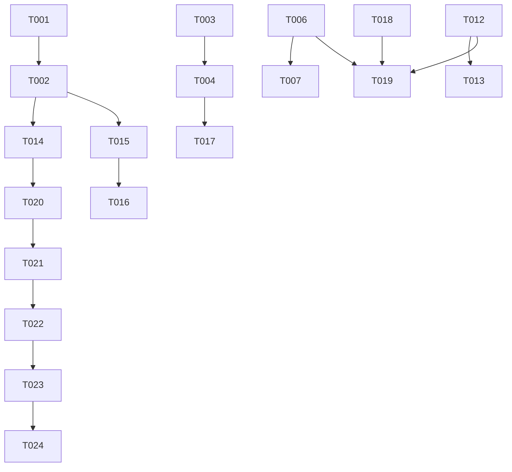

# Tasks: 第三轮实机反馈批次（ux-feedback-round3）

**Input**: Design documents from `spec/ux-feedback-round3/`
**Prerequisites**: plan.md（D1-D13）、spec.md（US1-US11）均已确认

**Tests**: 未要求测试任务，验证走 Phase 15（构建 + 模拟器/真机 UI 验证）。

**Organization**: 按用户故事分组，每个故事可独立实现与验证。项目为既有工程，无 Setup 阶段。

## Format: `[ID] [P?] [Story] Description`

- **[P]**: 可并行（不同文件、无未完成依赖）
- **[Story]**: 所属用户故事
- 所有路径相对仓库根目录

## Path Conventions

- 既有 HarmonyOS 单模块工程：源码根 `entry/src/main/ets/`，资源根 `entry/src/main/resources/`
- 文档在仓库根（PROJECT_NOTES.md）；spec 工件在 `spec/ux-feedback-round3/`
- 任务描述中的路径均为相对仓库根的完整路径

## Parallel Example: P1 故事并行

```bash
# Foundational 完成后，不同文件的任务可并行推进：
Task: T003 [P] [US1] PlayerOverlay.ets 圆弧尺寸同源改造
Task: T005 [P] [US2] MiniPlayer.ets 占位条 else 分支
Task: T009 [P] [US5] QueueSheet.ets 头部两行重构

# 同文件任务必须顺序（示例）：
Task: T003 → T004 → T017（均为 PlayerOverlay.ets，按此顺序执行）
Task: T006 → T007（均为 HomePage.ets，按此顺序执行）
```

---

## Phase 1: Foundational (Blocking Prerequisites)

**Purpose**: 全部故事依赖的常量收敛与日志基础设施

- [x] T001 常量收敛（plan D12）：将 `SEEK_STEP_MS`（自 entry/src/main/ets/pages/PlayerOverlay.ets L23）与 `SEEK_BY_DEBOUNCE_MS`（自 entry/src/main/ets/service/PlayerController.ets L33）迁入 entry/src/main/ets/service/Constants.ets 魔法数字区，新增 `LOG_BUFFER_MAX = 500`；同步更新两处原引用为 `Constants.SEEK_STEP_MS` / `Constants.SEEK_BY_DEBOUNCE_MS`
- [x] T002 新增内存环形日志服务（plan D9）：entry/src/main/ets/service/Logger.ets——exported `LogEntry`（time/category/summary/result）+ 静态 `log/snapshot/count/clear`，环形淘汰上限 `Constants.LOG_BUFFER_MAX`，写入全程 try/catch 静默，纯内存无 IO（依赖 T001 的 LOG_BUFFER_MAX）

**Checkpoint**: 基础就绪，用户故事可开始

---

## Phase 2: User Story 1 - 加载圆弧贴合播放按钮 (Priority: P1) 🎯 MVP

**Goal**: 缓冲弧线与常驻圆环紧贴播放按钮边缘
**Independent Test**: 播放无缓存歌曲触发缓冲，目视圆弧与按钮同心贴合

- [x] T003 [P] [US1] 圆弧尺寸同源改造（plan D2）：entry/src/main/ets/pages/PlayerOverlay.ets L995-1048——播放按钮直径/弧线半径/圆环半径由单一常量派生（消除 88/72/36/44 散落字面量），Path 命令按常量计算，Stack 显式 `alignContent(Alignment.Center)` 保证同心，弧线与按钮边缘保留 ~2px 均匀间隙

---

## Phase 3: User Story 2 - 无播放任务占位提示 (Priority: P1) 🎯 MVP

**Goal**: 空态下迷你条与播放层均显示占位提示
**Independent Test**: 清空队列后查看迷你条与播放层；添加歌曲后占位消失

- [x] T004 [US2] 播放层空态统一（plan D3）：entry/src/main/ets/pages/PlayerOverlay.ets L715-737——空态判定由 `trackIndex < 0 && playlistCount === 0` 改为 `trackIndex < 0 || playlistCount === 0`，占位文案改为"暂无播放内容"+引导；与播放键 enabled 条件的口径对称化（依赖 T003，同文件顺序执行）
- [x] T005 [P] [US2] 迷你条占位分支（plan D3）：entry/src/main/ets/component/MiniPlayer.ets——`if (this.hasContent)` 补 else 渲染占位条（占位封面+"暂无播放内容"，点击唤起播放层），`AS_MINI_PLAYER_VISIBLE` 上报逻辑同步为占位条也计入可见

**Checkpoint**: P1 双故事完成，MVP 可交付

---

## Phase 4: User Story 3 - 首页下拉刷新注释禁用 (Priority: P2)

**Goal**: 下拉手势不再触发刷新，代码注释保留可恢复
**Independent Test**: 首页下拉无刷新指示器；代码中可见注释块与恢复指引

- [x] T006 [P] [US3] 下拉刷新注释禁用（plan D4）：entry/src/main/ets/pages/HomePage.ets——Refresh 包裹层（L297-311）、`manualRefresh()`、`refreshing` 状态整块注释保留，注释头加 `[DISABLED 2026-10] 首页下拉刷新暂时禁用，恢复方式见 PROJECT_NOTES.md「已移除与禁用功能」` 标记，List 本体直接挂 `layoutWeight(1)`；`silentRefresh()` 保留不动

---

## Phase 5: User Story 4 - 更多按钮直达设置页并删除 MorePage (Priority: P2)

**Goal**: 首页右上角按钮直达设置页，MorePage 零残留
**Independent Test**: 点击按钮直达设置页；全局检索 morePage 无结果

- [x] T007 [US4] 更多按钮改跳设置页：entry/src/main/ets/pages/HomePage.ets L276-289——onClick 由 `pushPathByName('morePage', '')` 改为 `pushPathByName('settingsPage', '')`（依赖 T006，同文件顺序执行）
- [x] T008 [P] [US4] 删除 MorePage：删除 entry/src/main/ets/pages/MorePage.ets 文件，并移除 entry/src/main/resources/base/profile/router_map.json 中 morePage 条目（L13-17）

---

## Phase 6: User Story 5 - 播放队列标题独占一行 (Priority: P2)

**Goal**: 队列头部两行结构：标题行+操作行
**Independent Test**: 打开队列面板，标题独占一行、按钮在第二行，列表滚动无遮挡

- [x] T009 [P] [US5] 队列头部两行重构（plan D6）：entry/src/main/ets/component/QueueSheet.ets L312-387——拆为标题 Row（"播放队列"+"共 N 首"）与操作 Row（定位/搜索/多选/清空），多选模式行独立如旧；头部高度经既有 onAreaChange→headerHeight 动态测量自动被列表 contentStartOffset 跟随，无需额外适配

---

## Phase 7: User Story 6 - 单击订阅条目仅入队单条 (Priority: P2)

**Goal**: 单击条目只入队该条；播放全部行为不变
**Independent Test**: 订阅源详情单击一条，队列仅 +1；"播放全部"仍整源入队

- [x] T010 [P] [US6] 单条入队（plan D7）：entry/src/main/ets/pages/SourcePage.ets L165-167——`playEpisode(index)` 改为 `this.controller.loadPlaylistAndPlay([this.episodes[index]], 0)`（空队列即播、非空追加不打断）；`playAll()`（L158-163）不动

---

## Phase 8: User Story 7 - 播完列表即停 (Priority: P2)

**Goal**: 顺序/倒序播到末尾即停，不回绕；手动下一首仍回绕
**Independent Test**: 2 首歌顺序播完第二首即停；随机/单曲循环行为不变

- [x] T011 [P] [US7] 播完即停（plan D8）：entry/src/main/ets/service/PlayerController.ets L283-296 handleCompleted——SEQUENTIAL 且 `currentIndex >= len-1` 或 REVERSE 且 `currentIndex <= 0` 时停止（statusMsg='播放结束'，不调 next()）；REPEAT_ONE/RANDOM 原逻辑；`next()` 方法完全不动（手动回绕保留）

---

## Phase 9: User Story 8 - 播控中心 ±15 秒微调 (Priority: P3)

**Goal**: 播控中心五元组默认展示快退/快进按钮，点击 ±15 秒
**Independent Test**: 后台播放时展开播控中心，点 ±15 秒按钮进度变化 ≤1 秒误差

- [x] T012 [US8] MediaSession 微调命令（plan D1）：entry/src/main/ets/service/MediaSession.ets——init 新增 onFastForward/onRewind 回调槽位并注册 `session.on('fastForward')`/`session.on('rewind')`；调用 `session.setMediaCenterControlType(['playPrevious','playNext','fastForward','rewind'])`，调用处包裹 try/catch 并加 `[API24-COMPAT]` 注释标记（API<26 静默降级，未来 API 26 基线化后按 PROJECT_NOTES.md 登记统一移除）
- [x] T013 [US8] PlayerController 接线：entry/src/main/ets/service/PlayerController.ets L211-217 init 回调区——向 MediaSession 传入 `seekBy(+Constants.SEEK_STEP_MS)` / `seekBy(-Constants.SEEK_STEP_MS)` 作为微调回调（复用既有防抖路径）（依赖 T012）

---

## Phase 10: User Story 9 - 应用内日志页 (Priority: P3)

**Goal**: 设置页可查网络/错误日志，辅助观察 403
**Independent Test**: 触发一次失败请求后，设置→日志查询可见对应记录

- [x] T014 [US9] BiliService 日志钩子（plan D9）：entry/src/main/ets/service/BiliService.ets——httpGet（L150-171）/httpGetWithCookies（L173-212）/httpPostForm（L214-238）/resolveShortUrl（L718-747）四处记录请求与响应码/错误（URL 截掉 query string 仅留 host+path）；checkJsonBody（L127-137）风控命中记 'error' 条目；fetchUpInfo/fetchUpVideos 降级每轮成败各记一条（依赖 T002）
- [x] T015 [P] [US9] 日志面板组件（plan D10）：新建 entry/src/main/ets/component/LogSheet.ets——@Component，aboutToAppear 读 `Logger.snapshot()`，顶部标题+计数+清空按钮，LazyForEach 列表逐条显示 时间/类别标签/摘要/结果码，纯文本条目（依赖 T002）
- [x] T016 [US9] 设置页日志入口：entry/src/main/ets/pages/SettingsPage.ets——播放历史条目（L1293-1316）之后新增「日志查询」条目（同款 Row 卡片+条数角标），bindSheet 62% 承载 LogSheet 组件，`onBackPressed`（L1411-1421）加关闭分支（依赖 T015）

---

## Phase 11: User Story 10 - 封面下移与详情完整标题 (Priority: P3)

**Goal**: 封面顶部留白增加；详情展开显示完整标题
**Independent Test**: 播放页封面明显下移不失衡；长标题展开详情完整显示

- [x] T017 [P] [US10] 视觉微调（plan D11）：entry/src/main/ets/pages/PlayerOverlay.ets——封面容器 `margin({ top: 8 })`（L741-810 区域）调整为约 24（±8 目测定值）；详情 sheet 标题（L642-650）去掉 `maxLines(2)`+`textOverflow` 截断允许完整换行，收起态主标题单行省略不动（依赖 T004，同文件顺序执行）

---

## Phase 12: User Story 11 - PROJECT_NOTES.md 文档治理 (Priority: P3)

**Goal**: 文档改名+三章重构，登记完整
**Independent Test**: PROJECT_NOTES.md 存在、KNOWN_ISSUES.md 不存在（git mv 保历史）、三章完整

- [x] T018 [P] [US11] 文档重构（plan D13）：`git mv KNOWN_ISSUES.md PROJECT_NOTES.md` 后重构三章——①已知问题（KI-1~KI-4 原样迁移）②已移除与禁用功能（下载页三文件 @6d403dd、folders 页/列表同步/封面染色 @2050b84，每条含位置/原因/恢复线索）③规划与预告（列表添加逻辑重构预告、403 首次添加根因修复（本轮仅日志观察）、音质选择/默认音质、点赞/投币/收藏、历史云端同步、播控中心 API<26 限制、audio 三元组优先级限制、API 26 基线化后移除 `[API24-COMPAT]` 守卫）

**Checkpoint**: 全部 11 个故事完成

---

## Phase 13: Polish & Cross-Cutting Concerns

**Purpose**: 跨故事登记补全与残留检查

- [x] T019 PROJECT_NOTES.md 登记补全：确认本轮禁用/降级项全部登记——US3 下拉刷新禁用条目（含恢复步骤）、US8 的 [API24-COMPAT] 与系统限制；US6 的"列表添加逻辑后续还会改"预告已在册（依赖 T006/T012/T018）
- [x] T020 全局残留检查：检索 morePage 零引用；`SEEK_STEP_MS`/`SEEK_BY_DEBOUNCE_MS` 无重复定义（仅 Constants.ets）；`[DISABLED]`/`[API24-COMPAT]` 注释标记存在且指向 PROJECT_NOTES.md；entry/src/main/ets/pages/MorePage.ets 文件不存在

---

## Phase 14: Verification

<!-- verification_scope: build-only -->

**Purpose**: 构建 + 静态检查 + 部署。~~逐故事 UI 验证~~（2026-10-05 用户决策：验证范围降级 build-only——模拟器音频/播控行为与真机存在已知差异（faqs-app-running-6 模拟器音频假卡顿、传感器为软件模拟），UI 验证待真机可用时另行执行，T024 移入 deferred）。

- [x] T021 执行 `devecocli build` 构建工程并修复全部编译错误（迭代 修复→重建 直至成功，构建调用总数 ≤ 10 次）。
  【结果 PASS：3 次调用（600s 工具超时 / 编译失败 / 37.4s 成功）；修复 MediaSession.ets L46 `MediaCenterControlType[]`→`AVMediaCenterControlType[]`（依据 @ohos.multimedia.avsession.d.ts L723/L5434）；第二次验证会话增量构建再次确认产物与当前源码一致】
- [x] T022 对本轮全部改动 `.ets` 文件执行 `arkts_check` 严格模式静态检查，达到零诊断（与 T021 修复可合并轮次进行）。
  【结果 PASS：12 文件零诊断（含修复后的 MediaSession.ets）】
- [x] T023 部署应用：优先已连接真机，否则启动 MatePad Pro 11 模拟器，执行 `devecocli run --skip-build`（模拟器启动失败则标记跳过，T024 不执行）。
  【结果 PASS：无真机，MatePad Pro 11 模拟器（HarmonyOS 6.1.1 / API 24）部署成功；途中处理 9568263 版本降级（--uninstall 重装）与锁屏 10106102 Smoke 误报（手动解锁后通过）】
- [ ] ~~T024 逐用户故事 UI 验证~~（2026-10-05 用户决策降级 build-only，移入 deferred 待真机复验。两次被中断的验证会话已在模拟器完成大部分：US1-US7、US11 全 PASS；US8 部分 PASS——应用内 ±15s 生效、[API24-COMPAT] 降级日志实证，API 24 上五元组不可验证属预期；US9/US10 未开始。另发现未定论的 PlayerOverlay @State 滞留疑点：同源 emitUi 下迷你条数据新鲜、浮层停留在 aboutToAppear 快照，模拟器全量重启后复现，无证据表明本轮改动引入，触发条件未定位。）

---

## Dependencies & Execution Order

### Phase Dependencies

- **Foundational (Phase 1)**: T001 → T002，阻塞全部故事
- **User Stories (Phase 2-12)**: 均依赖 Phase 1；同文件任务必须顺序执行（T003→T004→T017 均涉 PlayerOverlay.ets；T006→T007 均涉 HomePage.ets）；跨文件故事可并行
- **Polish (Phase 13)**: T019 依赖 T006/T012/T018；T020 依赖全部故事任务
- **Verification (Phase 14)**: 依赖 Phase 13 完成

### User Story Dependencies

- **US1 (P1)**: T001 后即可开始，无跨故事依赖
- **US2 (P1)**: T004 依赖 T003（同文件）；T005 独立可并行
- **US3/US4 (P2)**: T006→T007 同文件顺序；T008 可并行
- **US6/US7 (P2)**: 完全独立
- **US8 (P3)**: T012→T013 顺序；依赖 T001（SEEK_STEP_MS 已收敛）
- **US9 (P3)**: T014/T015 依赖 T002；T015→T016 顺序
- **US10 (P3)**: 依赖 T004（同文件）
- **US11 (P3)**: 完全独立；T019 依赖之

### 📊 Dependency Graph



### ⚡ Parallel Execution Guide

| Phase | Tasks | Required Files | Execution Notes |
|---|---|---|---|
| Foundational | T001 → T002 | Constants.ets → Logger.ets | 顺序执行（T002 用 T001 的常量） |
| P1 故事 | T003/T005/T009/T010/T011 | PlayerOverlay / MiniPlayer / QueueSheet / SourcePage / PlayerController | 不同文件可并行；T004 等 T003 |
| P2 故事 | T006 → T007；T008 | HomePage.ets 顺序对；router_map+删除独立 | MorePage 删除不依赖按钮改造 |
| P3 播控 | T012 → T013 | MediaSession.ets → PlayerController.ets | 顺序执行 |
| P3 日志 | T014；T015 → T016 | BiliService / LogSheet → SettingsPage | 两链可并行 |
| P3 视觉/文档 | T017；T018 | PlayerOverlay（等 T004）/ PROJECT_NOTES.md | 互不冲突 |

---

## Implementation Strategy

### MVP First（P1 双故事）

1. Phase 1 Foundational（T001-T002）
2. US1（T003）+ US2（T004-T005）→ 独立验证：缓冲圆弧贴合 + 空态占位
3. P2 故事逐个落地，每个可独立目测
4. P3 功能（播控/日志/视觉/文档）+ Polish
5. Phase 14 验证（build + UI）

### Incremental Delivery

每个故事独立可交付：US1/US2 修观感 → US3-US7 修行为 → US8/US9 加功能 → US10/US11 收尾。任意 checkpoint 可停可验。

---

## Notes

- 单代理执行时按 T001→T024 顺序即可，[P] 标记仅供并行加速参考
- 同文件任务（PlayerOverlay.ets×3、HomePage.ets×2）严禁并行，避免编辑冲突
- T018 的 git mv 在实现阶段由子代理执行（`git mv` 保留历史）；git 提交策略不在任务内，由用户在验证后决定
- 验证阶段构建修复循环 ≤10 次、每故事 UI 验证 ≤3 次；模拟器内存瓶颈时跳过 UI 验证不阻塞
