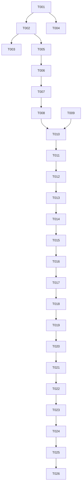

# Tasks: UX 反馈修复第 4 轮（播放与订阅体验批次）

**Input**: Design documents from `spec/ux-feedback-round4/`
**Prerequisites**: plan.md (required), spec.md (required for user stories)

**Tests**: 未要求自动化测试任务，本批验证以编译 + 部署为准（Phase 10）。

**Organization**: 任务按用户故事分组（9 个故事，P1→P2→P3 顺序），文件路径均为 `entry/src/main/ets/` 下存量文件。

## Format: `[ID] [P?] [Story] Description`

- **[P]**: 可并行（不同文件、无未完成依赖）
- **[Story]**: 所属用户故事

## Path Conventions

- 源码根：`entry/src/main/ets/`（单 HAP entry 模块，遵循现有架构，无新文件）

---

## Phase 1: Setup (Shared Infrastructure)

**Purpose**: 集中新增共享常量，避免多故事重复触碰 Constants

- [X] T001 新增共享常量（不动既有键值、不删弧线常量）：`AS_ON_SETTINGS_PAGE`（AppStorage 瞬态键）、日志文件名常量与 `LOG_FILE_MAX_BYTES`（字节级上限）、APP 投稿端点 URL、BiliDroid UA、ExClimbWuzhi 网关路径常量，写入 `entry/src/main/ets/service/Constants.ets`

**Checkpoint**: 共享常量就绪，后续任务可引用

---

## Phase 2: User Story 2 - 非首次切换剧集后进度条持续更新 (Priority: P1) 🎯 MVP

**Goal**: 消除切剧后进度条冻结的全部已识别路径（KI-1 监听器累积、广播截断、切剧状态残留、播放器实例串扰）

**Independent Test**: 连续切换 3 次以上剧集，每次进入播放后进度条 2 秒内恢复走动；拖动进度条后继续走动

### Implementation for User Story 2

- [X] T002 [US2] `PlayerController.subscribe` 改为返回退订句柄（闭包），`emitUi` 对每个监听器单独 try/catch（异常 hilog 警告 + Logger 'player' 类目记录，不中断循环），修改 `entry/src/main/ets/service/PlayerController.ets`
- [X] T003 [US2] `PlayerController.playIndex` 进入时重置 `lastEmittedSec = -1` 并取消挂起的 seekBy 防抖定时器（clearTimeout + 句柄复位）；为 playIndex/onPlayerState 状态迁移/seekBy 到期与取消添加 Logger 'player' 诊断埋点（与既有 hilog 双通道），修改 `entry/src/main/ets/service/PlayerController.ets`
- [X] T004 [P] [US2] `AudioPlayer.recreatePlayer` 增加实例代际号：每次重建递增，`setupCallbacks` 捕获当代代际，回调先比对代际再更新共享状态（playerState/_currentTime 等），杜绝旧实例残余事件串扰，修改 `entry/src/main/ets/service/AudioPlayer.ets`
- [X] T005 [US2] 四个调用方接入退订：MiniPlayer、QueueSheet、PlayerOverlay、SettingsPage 各自持有 subscribe 返回的句柄并在 `aboutToDisappear` 中调用，修改 `entry/src/main/ets/component/MiniPlayer.ets`、`entry/src/main/ets/component/QueueSheet.ets`、`entry/src/main/ets/pages/PlayerOverlay.ets`、`entry/src/main/ets/pages/SettingsPage.ets`
- [X] T006 [US2] `PlayerOverlay.syncFrom` 中当 controller 进入 preparing（切剧中）时复位 `isSeeking = false`，避免切剧瞬间拖拽导致 sliderValue 永久停更，修改 `entry/src/main/ets/pages/PlayerOverlay.ets`

**Checkpoint**: US2 完成——连续切剧进度条不冻结，日志可观测切剧链路

---

## Phase 3: User Story 1 - 播放详情页置顶打开播放列表 (Priority: P1) 🎯 MVP

**Goal**: 队列抽屉在播放浮层内绝对置顶展示，不被遮挡（层级失效仅在 API 24 平板复现，修复需全平台一致且不回退其他平台）

**Independent Test**: 播放详情页点播放列表按钮，抽屉置顶滑出可切歌；遮罩关闭正常；API 24 平板为主要验证目标，其余设备确认不回退

### Implementation for User Story 1

- [X] T007 [US1] PlayerOverlay 根 Stack 的 `if (this.showQueueSheet)` 分支显式添加最高 zIndex（高于倍速/模式/睡眠面板与内容层），修改 `entry/src/main/ets/pages/PlayerOverlay.ets`
- [X] T008 [P] [US1] QueueDrawer 面板进场由 `TransitionEffect.translate` 改为挂载时 animateTo 驱动的显式位移状态（from 100% → 0），退出反向；遮罩 OPACITY 过渡可保留，修改 `entry/src/main/ets/component/QueueDrawer.ets`

**Checkpoint**: US1 完成——浮层内播放列表按钮 100% 置顶打开抽屉

---

## Phase 4: User Story 3 - 未登录查询 UP 投稿（352 修复） (Priority: P1) 🎯 MVP

**Goal**: APP 端点优先 + Web 降级链补齐风控参数 + buvid 激活 + 兜底提示

**Independent Test**: 退出登录查询 UP 主，成功返回投稿列表；仍被风控时提示含"建议登录"

### Implementation for User Story 3

- [X] T009 [P] [US3] `BiliSession` 新增 `bNut` 字段与被动收集入口，`resetBuvid` 一并清空；BiliService 的 `buildHeaders`/`buildSpaceHeaders` Cookie 拼接包含 b_nut，修改 `entry/src/main/ets/service/BiliSession.ets` 与 `entry/src/main/ets/service/BiliService.ets`
- [X] T010 [US3] BiliService 新增 APP 端点投稿查询（`app.bilibili.com/x/v2/space/archive/cursor`，vmid/ps/pn/build/mobi_app/platform 参数 + BiliDroid UA，无 cookie/WBI），响应 `data.archives[]` 映射 BiliVideo（bvid/aid/title/pic/duration(秒)/pubdate/owner.mid/owner.name/owner.face/stat.view，title 经 cleanTitle、cover 规范化），修改 `entry/src/main/ets/service/BiliService.ets`
- [X] T011 [US3] `fetchUpVideos` 降级链重排为「APP 端点 → Web 直连 → Web WBI」，WBI 请求参数补齐 dm_img 全套（`dm_img_list='[]'`、`dm_img_str` 随机 base64(16-64 字节，字符域避开 %)、`dm_cover_img_str` 随机 base64(32-128 字节)、`dm_img_inter` 固定 JSON 串、`web_location='333.1387'`、`order_avoided='true'`、`tid='0'`），外部签名与错误码透出不变，修改 `entry/src/main/ets/service/BiliService.ets`
- [X] T012 [US3] `ensureBuvid` 成功获取 buvid 后执行一次 ExClimbWuzhi 激活（每进程一次，PiliPlus 最小伪装 payload，JSON body `{payload: <json串>}`，携带 buvid3 Cookie），从响应 Set-Cookie 收集 b_nut 存入 BiliSession；失败静默不阻塞，修改 `entry/src/main/ets/service/BiliService.ets`
- [X] T013 [P] [US3] AddSubscriptionSheet 风控 toast 文案补"建议登录"引导（保留错误码透出），修改 `entry/src/main/ets/pages/AddSubscriptionSheet.ets`

**Checkpoint**: US3 完成——未登录查询 UP 投稿优先走 APP 端点，降级链带全套风控参数，兜底提示友好

---

## Phase 5: User Story 4 - 播放页加载指示器重做 (Priority: P2)

**Goal**: 缓冲中播放键以系统 LoadingProgress 反馈，API 24/26 表现一致

**Independent Test**: 选歌自动播放触发缓冲，播放键显示加载圈；缓冲完成恢复暂停图标

### Implementation for User Story 4

- [X] T014 [US4] PlayerOverlay 播放键同心容器内，`isPreparing && playWhenReady` 时以 `LoadingProgress`（主题色、尺寸按 PLAY_BTN_DIAMETER 派生）替换播放/暂停 SymbolGlyph；删除自绘 270° Path 弧线、常驻装饰 Circle、`arcAngle` 状态、`updateArcSpin()`、`wasSpinning`、`playArcCommands()/playArcRadius()/playArcSize()`；同心 Stack 尺寸收敛为按钮本体，修改 `entry/src/main/ets/pages/PlayerOverlay.ets`
- [X] T015 [US4] Constants 移除 `PLAY_ARC_GAP`、`PLAY_ARC_STROKE`、`PLAY_RING_STROKE`（须在 T014 删除引用后执行；保留 `PLAY_BTN_DIAMETER`），修改 `entry/src/main/ets/service/Constants.ets`

**Checkpoint**: US4 完成——缓冲态加载指示跨 API 版本一致

---

## Phase 6: User Story 5 + 6 - 添加订阅页键盘与文案 (Priority: P2)

**Goal**: 提交查询自动收起键盘；按钮文案改"载入"

**Independent Test**: 输入内容点按钮/输入法提交，键盘收起且结果可见；按钮显示"载入"

### Implementation for User Story 5 + 6

- [X] T016 [US5] 主输入 TextInput 增加 `enterKeyType(Search)` 与 `onSubmit`（触发 handleMainInput）；`handleMainInput` 入口处统一 `stopInputSession` 收起软键盘（覆盖按钮/提交/非法输入全部分支），修改 `entry/src/main/ets/pages/AddSubscriptionSheet.ets`
- [X] T017 [US6] 主输入行按钮文案"添加"→"载入"（行为不变），修改 `entry/src/main/ets/pages/AddSubscriptionSheet.ets`

**Checkpoint**: US5/US6 完成——提交即收键盘，文案语义准确

---

## Phase 7: User Story 9 - 日志落盘与诊断日志 (Priority: P2)

**Goal**: 日志异步落盘（硬上限滚动淘汰），US2 关键路径可事后定位

**Independent Test**: 操作后重启应用，沙箱日志文件存在且含操作记录；超量日志后文件不超上限；LogSheet 面板行为不变

### Implementation for User Story 9

- [X] T018 [US9] Logger 增加异步落盘：每条日志追加写入沙箱文件（单行可读格式：时间戳+category+summary+result），fire-and-forget 不阻塞主流程，失败静默；每次落盘检查文件大小，超 `LOG_FILE_MAX_BYTES` 保留最新一半重写（滚动淘汰）；内存环形缓冲 API（log/snapshot/count/clear）与 LogSheet 行为不变；启动不回读，修改 `entry/src/main/ets/service/Logger.ets`
- [X] T019 [US9] 核查并补全 'player' 诊断埋点：T002/T003 已埋的 emitUi 异常隔离、切剧重置、状态迁移之外，确认订阅/退订生命周期（调用方标识）也有 Logger 条目，不足处补齐，修改 `entry/src/main/ets/service/PlayerController.ets`

**Checkpoint**: US9 完成——日志落盘有界，播放链路全程可追溯

---

## Phase 8: User Story 7 + 8 - 播放胶囊展示规则 (Priority: P3)

**Goal**: 设置页隐藏胶囊；其余页面胶囊左右留 16vp 边距

**Independent Test**: 播放中进设置页胶囊消失、返回恢复；首页/源页胶囊左右有留白不贴边

### Implementation for User Story 7 + 8

- [X] T020 [P] [US7] SettingsPage `aboutToAppear` 置 `AS_ON_SETTINGS_PAGE=true`、`aboutToDisappear` 置 false，修改 `entry/src/main/ets/pages/SettingsPage.ets`
- [X] T021 [US7] Index 胶囊容器 visibility 条件扩展为 `showPlayerOverlay || onSettingsPage` 时隐藏（@StorageLink 绑定新键），修改 `entry/src/main/ets/pages/Index.ets`
- [X] T022 [US8] Index 胶囊宿主 Column 增加水平 padding 16；MiniPlayer 内容态/空态 Row 的 margin 移除 left/right 分量（保留 bottom），修复 `width('100%')`+margin 溢出贴边，修改 `entry/src/main/ets/pages/Index.ets` 与 `entry/src/main/ets/component/MiniPlayer.ets`

**Checkpoint**: US7/US8 完成——胶囊展示规则正确、留边生效

---

## Phase 9: Polish & Cross-Cutting Concerns

**Purpose**: 跨故事收尾与文档

- [X] T023 更新 `PROJECT_NOTES.md`：KI-1 标记已修复（订阅退订+异常隔离）、KI-5 记录应用层加固（zIndex+animateTo+多层修复）与观察结论、KI-2 保持待办
- [X] T024 全局回查：确认无 `arcAngle`/`PLAY_ARC_*`/`PLAY_RING_*` 残留引用、无 `subscribe` 旧调用签名遗漏、无 dm_img 参数遗漏分支；对全量改动 .ets 文件跑 `arkts_check` 静态检查

---

## Phase 10: Verification

<!-- verification_scope: build-only -->

**Purpose**: 构建与部署验证（用户已选择 build-only，不含 UI 验证任务）

- [X] T025 构建项目并修复编译错误直至成功（调用 `devecocli build`，迭代 修复→构建）
- [X] T026 部署应用到设备/模拟器（调用 `devecocli run --skip-build`）

---

## Dependencies & Execution Order

### Phase Dependencies

- **Setup (Phase 1)**: 无依赖，立即开始；阻塞所有后续任务（提供共享常量）
- **User Stories (Phase 2–8)**: 依赖 T001；建议按 P1→P2→P3 顺序执行
- **Polish (Phase 9)**: 依赖全部故事任务完成
- **Verification (Phase 10)**: 依赖 Phase 9 完成

### User Story Dependencies

- **US2 (P1)**: T001 后即可开始；T005 依赖 T002（新签名）；T006 依赖 T005（同文件 PlayerOverlay 顺序编辑）
- **US1 (P1)**: T007 依赖 T005/T006（同文件 PlayerOverlay，避免编辑冲突）；T008 可与 T007 并行
- **US3 (P1)**: T010/T011/T012 同文件顺序执行；T009 可与 T010 并行（BiliSession 独立）；T013 可与 T009–T012 并行
- **US4 (P2)**: T014 依赖 T008（同文件 PlayerOverlay 顺序）；T015 严格依赖 T014（先删引用再删常量）
- **US5+US6 (P2)**: T016→T017 同文件顺序
- **US9 (P2)**: T018 可独立；T019 依赖 T002/T003 完成后核查
- **US7+US8 (P3)**: T020/T021 依赖 T001；T022 依赖 T021（同文件 Index 顺序）

### Within Each User Story

- 服务层（PlayerController/BiliService/Logger）先于 UI 层（页面/组件）
- 同文件任务严格按 ID 顺序执行，避免编辑冲突

## ⚡ Parallel Execution Guide

| Phase | Tasks | Required Files | Execution Notes |
|-------|-------|----------------|-----------------|
| US2 | T004 ∥ T002/T003 | AudioPlayer.ets ∥ PlayerController.ets | 不同文件可并行 |
| US1 | T008 ∥ T007 | QueueDrawer.ets ∥ PlayerOverlay.ets | T007 需在 T005/T006 之后（同文件顺序） |
| US3 | T009 ∥ T010 | BiliSession.ets ∥ BiliService.ets | T009 的 buildHeaders 部分与 T010 同文件时以 T010 为准合并 |
| US7 | T020 ∥ T021 | SettingsPage.ets ∥ Index.ets | T021 依赖 T001 的键定义（已完成） |



## Parallel Example: User Story 2

```bash
# 并行启动不同文件的任务：
Task: "T004 AudioPlayer 代际令牌"   # entry/src/main/ets/service/AudioPlayer.ets
Task: "T002 subscribe/emitUi 修改"  # entry/src/main/ets/service/PlayerController.ets

# 同文件任务保持顺序：
T002 → T003（PlayerController.ets）
T005 → T006（跨 4 文件退订，随后 PlayerOverlay isSeeking 复位）
```

## Implementation Strategy

### MVP First (P1 Stories Only)

1. 完成 Phase 1: Setup（T001）
2. 完成 Phase 2: US2 进度冻结（T002–T006）
3. 完成 Phase 3: US1 抽屉置顶（T007–T008）
4. 完成 Phase 4: US3 未登录 352（T009–T013）
5. **STOP and VALIDATE**: 编译验证 P1 三故事（此时可提前跑一次 `devecocli build` 确认无回归）

### Incremental Delivery

1. Setup → Foundation ready
2. US2 → US1 → US3（P1，发布价值核心）
3. US4 → US5/US6 → US9（P2）
4. US7/US8（P3）→ Polish → Verification
5. 每个故事 Checkpoint 均可独立验证，不破坏已完成故事

### Sequential Execution (Single Agent)

单人/单代理按 T001→T026 顺序执行即可；[P] 标记仅提示"如有多代理可并行"，顺序执行无冲突。

## Notes

- [P] 任务 = 不同文件、无未完成依赖
- [Story] 标签映射 spec.md 用户故事，保证可追溯
- 同一文件被多个故事触碰时（PlayerOverlay: US1+US2+US4；Index: US7+US8；MiniPlayer: US2+US8；SettingsPage: US2+US7；AddSubscriptionSheet: US3+US5+US6），任务已按 ID 顺序排列，严格顺序执行避免编辑冲突
- T015（删弧线常量）严格后于 T014（删引用），否则编译失败
- Verification 为 build-only（用户已选择），不含 UI 验证任务

## Summary Report

- **总任务数**: 26（T001–T026）
- **按故事分布**: Setup 1；US2 5；US1 2；US3 5；US4 2；US5+US6 2；US9 2；US7+US8 3；Polish 2；Verification 2
- **并行机会**: 4 组（见 Parallel Execution Guide）
- **独立测试标准**: 各故事 Checkpoint 已给出独立验证方式
- **建议 MVP 范围**: T001→T013（P1 三故事：US2 进度冻结、US1 抽屉置顶、US3 未登录 352）
