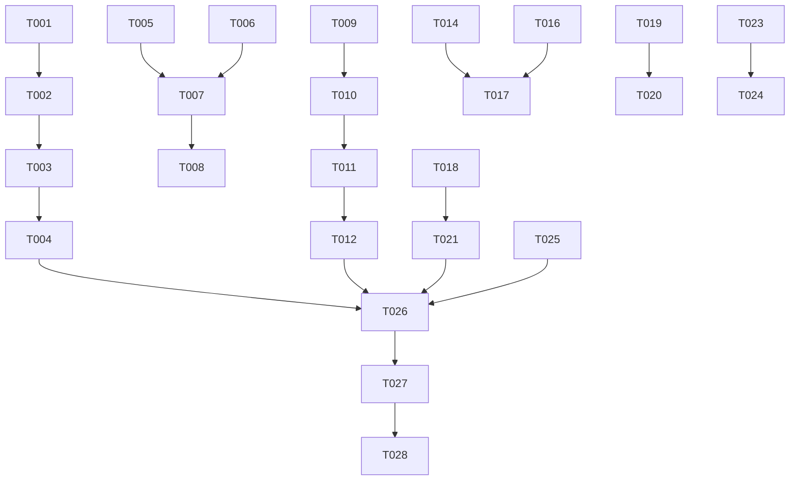

# Tasks: UX 反馈第 5 轮修复（订阅 / 播放 / 设置 14 项）

**Input**: Design documents from `spec/ux-feedback-round5/`（spec.md + plan.md）
**Prerequisites**: plan.md (required), spec.md (required for user stories)
**Tests**: 未要求测试任务，不包含。
**Organization**: 任务按用户故事（US1~US7）分组，每个故事可独立实现与验证。

## Format: `[ID] [P?] [Story] Description`

- **[P]**: 可并行（不同文件、无未完成依赖）
- **[Story]**: 所属用户故事（US1~US7）
- 所有描述含精确文件路径

## Path Conventions

- 单项目：源码根 `entry/src/main/ets/`（既有 HarmonyOS 工程，无新增目录）

---

## Phase 1: Setup (Shared Infrastructure)

**Purpose**: 项目初始化与基础结构

无任务——既有工程直接定点修改，无需任何初始化（工程根 `build-profile.json5` / `oh-package.json5` 已存在）。

---

## Phase 2: Foundational (Blocking Prerequisites)

**Purpose**: 阻塞所有用户故事的前置基础设施

无任务——本轮无跨故事共享基础设施；各故事所需的契约扩展（CoverThumb raw 参数、BiliService aid 查询）已内置于对应故事阶段（T005 / T009），因其仅被单一故事消费。

**Checkpoint**: 前置就绪，用户故事可按优先级顺序开始。

---

## Phase 3: User Story 1 - 订阅源列表对齐 B 站投稿列表 (Priority: P1) 🎯 MVP

**Goal**: 列表新上旧下、触底自动加载更早、已播条目显示明确已播标记（取代灰色标题）。
**Independent Test**: 打开任一有缓存的订阅源，验证首条为最新、触底追加更早、已播条目有标记且标题颜色一致、手动刷新回顶部、NEW 徽标正常。

**Implementation for User Story 1**（全部位于 `entry/src/main/ets/pages/SourcePage.ets`，串行执行）:

- [x] T001 [P] [US1] 展示顺序改新→旧：`loadFromCache()` 去掉 `reverse()`，直接按缓存顺序（新→旧）渲染列表，移除旧→新展示语义（entry/src/main/ets/pages/SourcePage.ets）
- [x] T002 [US1] 翻页方向改造：加载更早由 `onReachStart`（顶部）改为 `onReachEnd`（底部）触发，`loadOlder` 结果由前插（`older.concat(episodes)`）改为追加尾部（`episodes.concat(older)`），移除顶部加载更早路径（entry/src/main/ets/pages/SourcePage.ets，依赖 T001）
- [x] T003 [US1] 已播标记：已播条目标题颜色由 `text_secondary` 统一为 `text_primary`，并在条目元信息行增加明确已播图标（使用系统 symbol，须先在本机 `sysResource.js` 确认存在，不新增资源文件）；判定来源 `playedSet` 不变（entry/src/main/ets/pages/SourcePage.ets，依赖 T002）
- [x] T004 [US1] 边界与回归防护：手动刷新完成后列表回到顶部；缓存不足一页或已到最早内容时触底不重复请求、无死循环；NEW 徽标（`seenBefore`/`markSeen`）与刷新链路行为不变（entry/src/main/ets/pages/SourcePage.ets，依赖 T003）

**Checkpoint**: US1 独立可验证。

---

## Phase 4: User Story 2 - 添加订阅：输入识别与文案优化 (Priority: P1)

**Goal**: av 号识别并播放、纯数字=UID、placeholder 简化、"载入"→"查询"。
**Independent Test**: 添加订阅面板分别输入 av 号（大小写）、纯数字、BV 号、链接，逐一验证识别与提示文案。

**Implementation for User Story 2**:

- [x] T005 [P] [US2] BiliService 新增按 aid 查询视频信息的静态方法：复用 B 站 view 接口的 aid 参数，返回既有 `BiliVideo`（含 bvid），签名与 `fetchVideoInfo(bvid)` 对称，供 av 号归一化（entry/src/main/ets/service/BiliService.ets）
- [x] T006 [US2] `recognizeInput` 识别扩展：新增 av 分支 `^av(\d+)$`（忽略大小写，置于 BV 分支之后）→ `type='av'`；纯数字分支由 `^(\d{5,})$` 放宽为 `^(\d+)$` → `type='up'`（entry/src/main/ets/pages/AddSubscriptionSheet.ets）
- [x] T007 [US2] `handleMainInput` 新增 `'av'` case：调用 T005 的 aid 查询归一化出 bvid 后，复用既有 `playBv`/`addToPlaylist` 链路播放；短链解析后的 switch 同步补齐 `'av'` 分支（entry/src/main/ets/pages/AddSubscriptionSheet.ets，依赖 T005、T006）
- [x] T008 [US2] 文案更新：输入框 placeholder 改为"粘贴链接 / UP 主 UID / av 号"，主按钮文案"载入"→"查询"，加载中 LoadingProgress 状态不变（entry/src/main/ets/pages/AddSubscriptionSheet.ets，依赖 T007）

**Checkpoint**: US2 独立可验证。

---

## Phase 5: User Story 3 - 添加订阅：动效与封面修复 (Priority: P1)

**Goal**: 查询结果出现带过渡动画、一级↔二级视图双向层级转场、UP 头像/合集封面正常加载、无封面占位全类型统一。
**Independent Test**: 查询一个 UP 主验证头像显示与结果过渡，进入其合集列表验证层级转场，对比各类型无封面占位一致性。

**Implementation for User Story 3**:

- [x] T009 [P] [US3] CoverThumb 新增可选 raw 参数（布尔，默认 false 保持既有调用点行为）：raw=true 时不拼 `@240w_240h_1c.webp` 缩略后缀，直接加载原始 URL；占位形态（♪+玻璃底+边框）确认为全类型唯一无图形态（entry/src/main/ets/component/CoverThumb.ets）
- [x] T010 [US3] 添加订阅面板封面修复：UP 头像（`upFace`）与合集/系列封面调用 CoverThumb 时传 raw=true（头像/合集封面拼后缀会 404 是不加载根因）；确认收藏夹/UP/合集/系列无封面时占位样式一致（entry/src/main/ets/pages/AddSubscriptionSheet.ets，依赖 T009；注意与 US2 同文件，须在 US2 完成后进行）
- [x] T011 [US3] 查询结果过渡动画：UP 信息卡片/查询结果列表出现的状态变更包在 `animateTo` 中，目标视图挂 `TransitionEffect`（透明度+位移，250-350ms），消除瞬间弹出（entry/src/main/ets/pages/AddSubscriptionSheet.ets，依赖 T010）
- [x] T012 [US3] 一级↔二级视图层级转场：`folderView` / `upDetailView` 切换时 `animateTo` 驱动，二级视图右侧滑入、一级视图左滑淡出，返回反向（含"我的收藏夹"、UP 合集/系列列表两个入口）（entry/src/main/ets/pages/AddSubscriptionSheet.ets，依赖 T011）

**Checkpoint**: US3 独立可验证。

---

## Phase 6: User Story 4 - 播放历史 → 播放浮层返回行为修复 (Priority: P1)

**Goal**: 播放浮层打开时，返回键一次仅关浮层、历史面板保持打开；再按返回才关面板。
**Independent Test**: 设置页 → 播放历史 → 点条目 → 按返回逐层验证：关浮层（面板在）→ 关面板（设置页在）。

**Implementation for User Story 4**:

- [x] T013 [P] [US4] `playHistoryPanel` 的 bindSheet 增加 `shouldDismiss` 拦截：播放浮层打开（`AS_SHOW_PLAYER_OVERLAY` 为 true）时拒绝本次关闭请求、转而关闭播放浮层并保持 sheet 打开；浮层未打开时正常放行关闭；`replayHistory` 保持面板不关、浮层弹出的现状（entry/src/main/ets/pages/SettingsPage.ets）

**Checkpoint**: US4 独立可验证。

---

## Phase 7: User Story 5 - 无图模式：更名与全链路生效 (Priority: P2)

**Goal**: 选项更名"无图模式"；播放列表封面与系统播控封面遵守无图模式；开关切换即时刷新。
**Independent Test**: 开关无图模式后检查播放列表条目封面与锁屏/媒体控制中心封面，关闭后恢复。

**Implementation for User Story 5**:

- [x] T014 [US5] 设置页更名：选项名"省流量模式"→"无图模式"，分组标题"省流量设置"→ 匹配新名称的标题，副标题按新语义微调；存储键 `KEY_DATA_SAVER` 与存量值不变（entry/src/main/ets/pages/SettingsPage.ets；注意与 US4 同文件，须在 T013 后进行）
- [x] T015 [P] [US5] QueueSheet 条目封面判无图模式：条目 `CoverThumb` 调用前判 dataSaver 置空封面（dataSaver 读取方式对齐 MiniPlayer 现有链路），置空后走 CoverThumb 占位（entry/src/main/ets/component/QueueSheet.ets）
- [x] T016 [P] [US5] 系统播控封面判无图模式：`PlayerController` 调 `mediaSession.updateTrack` 时封面参数判 dataSaver 置空；`MediaSession.updateTrack` 支持空封面——空时不设置 `AVMetadata` 对应字段而非传旧值（entry/src/main/ets/service/PlayerController.ets 与 entry/src/main/ets/service/MediaSession.ets）
- [x] T017 [US5] 开关切换即时刷新：无图模式开关回调在既有 `refreshUi` 之外，对当前播放曲目重发一次 `updateTrack`，使系统播控元数据即时更新（entry/src/main/ets/pages/SettingsPage.ets，依赖 T016）

**Checkpoint**: US5 独立可验证。

---

## Phase 8: User Story 6 - 设置页清理与播放胶囊显隐修复 (Priority: P2)

**Goal**: 彻底移除"取消收藏历史"（保留取消收藏功能）；胶囊随返回转场即时平滑出现。
**Independent Test**: 设置页确认无"取消收藏历史"；播放页取消收藏仍可用；进出设置页观察胶囊动画时机；设置页前台时胶囊隐藏。

**Implementation for User Story 6**:

- [x] T018 [US6] SettingsPage 移除"取消收藏历史"：入口行、`historyPanel` 浮层 builder、`historyItems` 状态、`openHistory` 及相关 import 全部移除（注意保留 `playHistoryPanel` 播放历史面板，勿删错）（entry/src/main/ets/pages/SettingsPage.ets；同文件须在 T017 后进行）
- [x] T019 [P] [US6] PlayerController 移除记录链：`unfavoriteHistory` 字段、`pushHistory`、`removeHistoryItem`、`clearUnfavoriteHistory` 及初始化加载调用；`unfavoriteCurrent` 仅去掉 `pushHistory` 调用，取消收藏 API 调用与操作提示保留（entry/src/main/ets/service/PlayerController.ets）
- [x] T020 [P] [US6] AppStore 移除 `loadUnfavoriteHistory` / `saveUnfavoriteHistory`；删除 `entry/src/main/ets/model/UnfavoriteRecord.ets` 文件；遗留 `unfavorite_history.json` 不清理（entry/src/main/ets/service/AppStore.ets 与 entry/src/main/ets/model/UnfavoriteRecord.ets，依赖 T019）
- [x] T021 [US6] 胶囊状态时机：`AS_ON_SETTINGS_PAGE` 置 false 从 `aboutToDisappear` 提前到 `onWillDisappear`（转场开始时），置 true 对称提前到 `onWillAppear`（entry/src/main/ets/pages/SettingsPage.ets，依赖 T018）
- [x] T022 [US6] 胶囊显隐动画：MiniPlayer 保持挂载，显隐控制从 `Visibility.None/Visible` 改为 opacity(0/1)+translateY 属性动画（`animateTo` 约 250ms），透明时 `hitTestBehavior(HitTestMode.None)` 不响应点击；`AS_MINI_PLAYER_VISIBLE` 上报与 `MINI_PLAYER_CLEARANCE` 避让不变（entry/src/main/ets/component/MiniPlayer.ets 与 entry/src/main/ets/pages/Index.ets）

**Checkpoint**: US6 独立可验证。

---

## Phase 9: User Story 7 - 播放列表交互打磨 (Priority: P3)

**Goal**: 返回键退出播放列表也走滑出动画；多选模式前后操作行按钮尺寸一致。
**Independent Test**: 播放列表用返回键/遮罩退出对比动画一致；切换多选模式观察按钮无尺寸跳变。

**Implementation for User Story 7**:
- [x] T023 [P] [US7] QueueDrawer 暴露关闭句柄：新增关闭句柄注册回调属性，`aboutToAppear` 时把内部 `closeWithSlide`（滑出动画后卸载）注册给宿主，`aboutToDisappear` 注销（entry/src/main/ets/component/QueueDrawer.ets）

- [x] T024 [US7] Index.onBackPress 队列分支改调注册的关闭句柄（播放滑出动画后再卸载），句柄为空时回退直接置 `showQueueSheet=false` 卸载；遮罩点击退出路径不动（entry/src/main/ets/pages/Index.ets，依赖 T023；注意与 US6 的 T022 同文件，须在 T022 后进行）

- [x] T025 [US7] QueueSheet 操作行按钮尺寸统一 36vp：普通模式操作行按钮由 height(30) 对齐多选态 36，按钮内图标/文字布局随高度适配（entry/src/main/ets/component/QueueSheet.ets；注意与 T015 同文件，须在 T015 后进行）
**Checkpoint**: US7 独立可验证。

---

## Phase 10: Polish & Cross-Cutting Concerns

**Purpose**: 跨故事收尾与文档同步

- [x] T026 更新 PROJECT_NOTES.md：第二章登记"取消收藏历史移除"（REM 条目：移除范围、恢复线索=git 历史、遗留 unfavorite_history.json 说明）；复核第三章"无图模式覆盖面扩展"条目与最终实现一致（PROJECT_NOTES.md，依赖 T018-T020）

---

## Phase 11: Verification

<!-- verification_scope: build-only -->

**Purpose**: 构建与部署验证（本轮范围：仅构建 + 部署，不做 UI 验证）

- [x] T027 Build project and fix any compilation errors (invoke `devecocli build`; iterate fix → build until success)
- [x] T028 Deploy application to device/emulator (invoke `devecocli run --skip-build`; depends on T027)

---

## Dependencies & Execution Order

### Phase Dependencies

- **Setup / Foundational（Phase 1-2）**: 无任务，直接进入故事实现
- **User Stories（Phase 3-9）**: 按优先级 P1（US1→US2→US3→US4）→ P2（US5→US6）→ P3（US7）顺序执行；单实现者串行推进（同文件冲突见下）
- **Polish（Phase 10）**: 依赖全部故事完成
- **Verification（Phase 11）**: 依赖 Polish 完成

### User Story Dependencies

- US1（SourcePage.ets）：无跨故事依赖，可最先进行
- US2 与 US3 共享 `AddSubscriptionSheet.ets`：**必须串行**（US2 → US3），T010 起依赖 T008 完成
- US4、US5、US6 共享 `SettingsPage.ets`：**必须串行**（T013 → T014 → T017/T018 → T021）
- US6（T022）与 US7（T024）共享 `Index.ets`：**必须串行**（T022 → T024）
- US5（T015）与 US7（T025）共享 `QueueSheet.ets`：**必须串行**（T015 → T025）
- 各故事之间无功能依赖，文件不冲突时理论可并行（见并行表）

### Within Each User Story

- 服务/组件契约先行（T005、T009、T023），消费方在后（T007、T010、T024）
- 同文件内任务按编号顺序执行

## 📊 Dependency Graph



## ⚡ Parallel Execution Guide

> 单实现者（subagent）场景按故事顺序串行即可；下表仅供多实现者参考。

| Phase | Tasks | Required Files | Execution Notes |
|-------|-------|----------------|-----------------|
| US1 | T001-T004 | pages/SourcePage.ets | 与其他故事零文件冲突，可与 US2/US4/US5/US7 部分任务并行 |
| US2 服务层 | T005 | service/BiliService.ets | 独立文件，任意时刻可做 |
| US3 组件层 | T009 | component/CoverThumb.ets | 独立文件，任意时刻可做 |
| US2/US3 UI 层 | T006-T008, T010-T012 | pages/AddSubscriptionSheet.ets | 同文件互斥，先 US2 后 US3 |
| US4 | T013 | pages/SettingsPage.ets | 与 US5/US6 的 SettingsPage 任务互斥，三者串行 |
| US5 | T015, T016 | component/QueueSheet.ets, service/PlayerController.ets + MediaSession.ets | T015 与 T025（QueueSheet）互斥；T016 与 T019（PlayerController）互斥 |
| US6 | T019, T020, T022 | service/PlayerController.ets, service/AppStore.ets, model/UnfavoriteRecord.ets, component/MiniPlayer.ets + pages/Index.ets | T022 与 T024（Index）互斥 |
| US7 | T023, T025 | component/QueueDrawer.ets, component/QueueSheet.ets | T023 独立；T025 依赖 T015 完成 |

## Parallel Example: User Story 1

```text
# 若多实现者并行，可同时启动（互不冲突文件）：
Task: T001 [US1] 订阅源列表排序反转（pages/SourcePage.ets）
Task: T005 [US2] BiliService aid 查询方法（service/BiliService.ets）
Task: T009 [US3] CoverThumb raw 参数（component/CoverThumb.ets）
Task: T013 [US4] 历史面板 shouldDismiss 拦截（pages/SettingsPage.ets）
Task: T019 [US6] PlayerController 移除取消收藏记录链（service/PlayerController.ets）
Task: T023 [US7] QueueDrawer 关闭句柄（component/QueueDrawer.ets）

# 同文件任务随后串行收敛（如 AddSubscriptionSheet.ets 上 T006→T007→T008→T010→T011→T012）
```

## Implementation Strategy

### MVP First（若需分批交付）

1. US1 + US2 + US3 + US4（全部 P1）即构成可交付的 MVP 体验修复
2. US5 + US6（P2）为第二批
3. US7（P3）+ Polish 收尾

---

## Notes

- [P] 任务 = 不同文件且无未完成依赖
- [Story] 标签映射 spec.md 用户故事，可追溯（FR-001~020 全覆盖）
- 每个故事完成后可独立人工验证（本轮 build-only，不含自动 UI 验证任务）
- 同文件跨故事串行约束见"User Story Dependencies"，实现时务必遵守，避免编辑冲突
- 删除 `model/UnfavoriteRecord.ets` 前确认全库无残留 import（T020 收尾时全局检索）
- 播放浮层架构约束（KI-5 方案 B：Index Stack 内条件渲染）与胶囊保持挂载约束在实现全程不得违反
